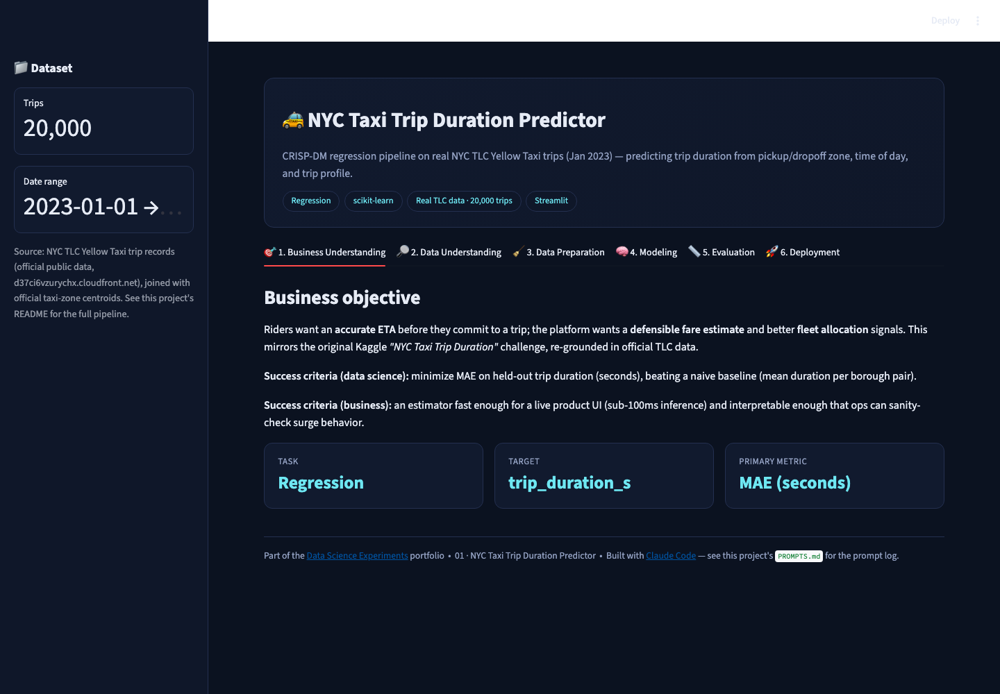
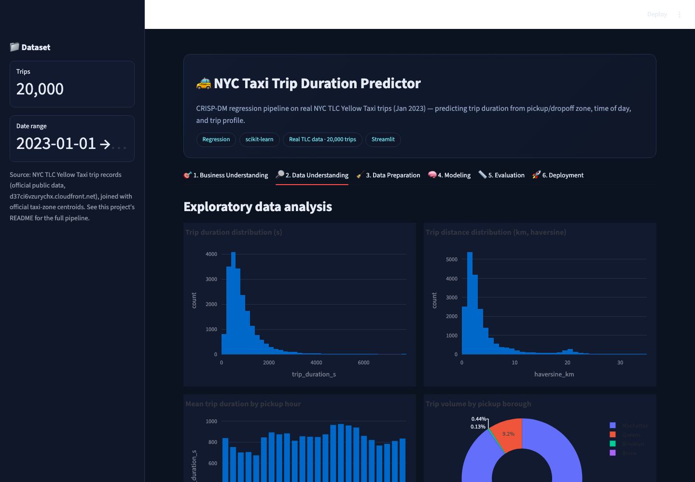
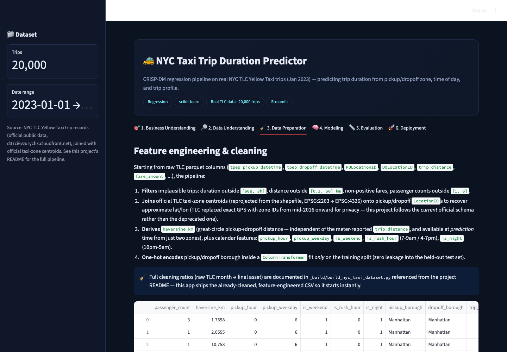
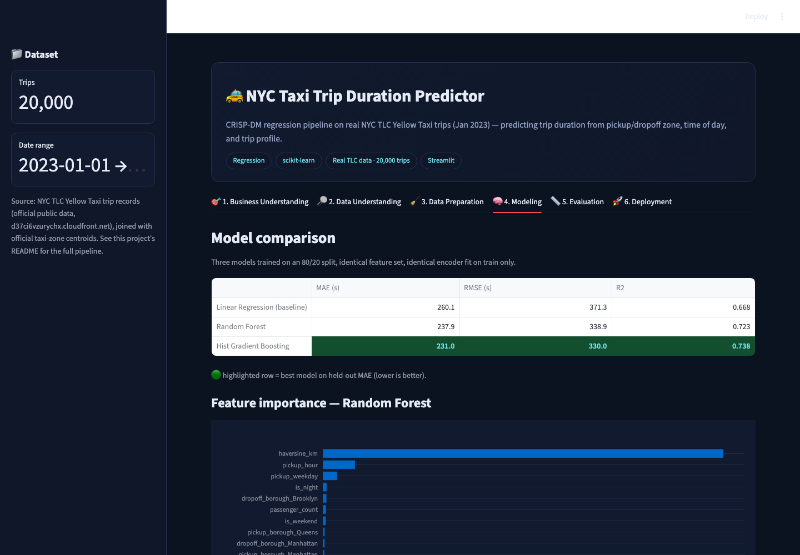
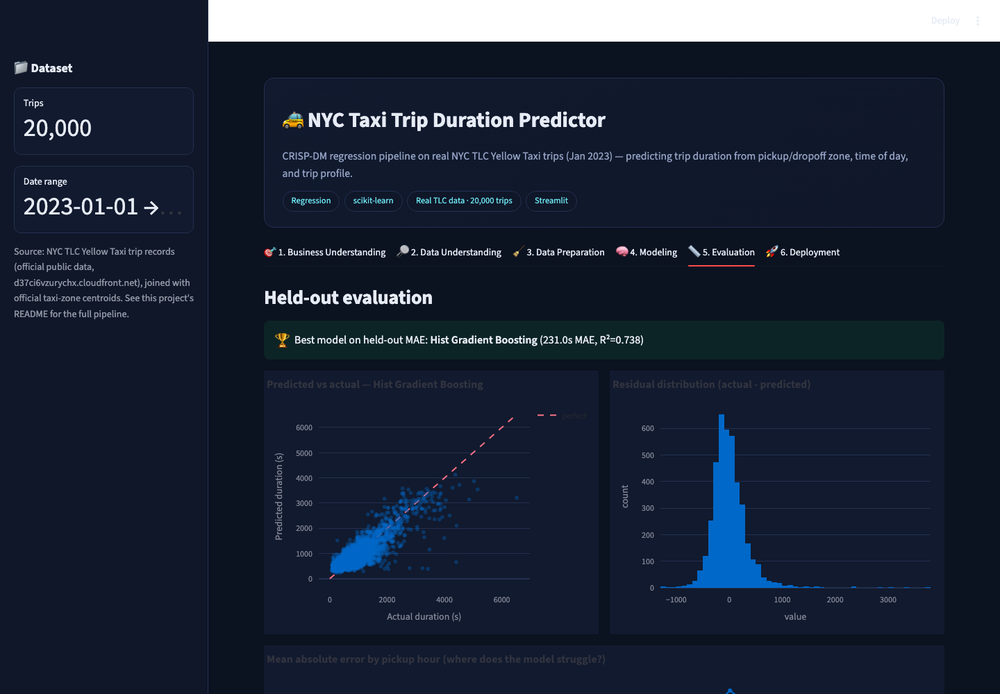

# 🚕 NYC Taxi Trip Duration Predictor

A CRISP-DM regression project: given a pickup zone, dropoff zone, and time of
day, how long will an NYC yellow-taxi trip take — and roughly what will it
cost? Built as a single-file Streamlit app on **real NYC TLC trip data**.

▶ **Run it:** `streamlit run app.py` (from this folder, with the repo's
`requirements.txt` installed) → open `http://localhost:8501`

[⬅ Back to portfolio root](../README.md) · [Prompt log](./PROMPTS.md)

---

## The business problem

Riders want an accurate ETA before committing to a trip; the platform wants
a defensible fare estimate and better fleet-allocation signals. This mirrors
the original Kaggle *"NYC Taxi Trip Duration"* challenge, re-grounded in
official TLC data rather than the (now-deprecated) Kaggle CSV.

**Primary metric:** MAE (mean absolute error) on trip duration, in seconds —
directly interpretable ("the model is typically off by about *n* minutes"),
unlike RMSE or R² alone.

## The dataset

20,000 real trips sampled from **NYC TLC's official Yellow Taxi trip
records, January 2023** (`d37ci6vzurychx.cloudfront.net`), joined with the
official taxi-zone shapefile (reprojected `EPSG:2263 → EPSG:4326`) to
recover approximate pickup/dropoff coordinates — TLC replaced raw GPS
lat/lon with zone IDs in mid-2016 for rider privacy, so this project follows
the *current* official schema rather than the deprecated one Kaggle's
original competition used. See [`../_build/build_nyc_taxi_dataset.py`](../_build/build_nyc_taxi_dataset.py)
for the exact pipeline.

## Screenshot tour

| Business Understanding | Data Understanding |
|---|---|
|  |  |

| Data Preparation | Modeling |
|---|---|
|  |  |

| Evaluation | Deployment (live estimate) |
|---|---|
|  |  |

## Walking through the six CRISP-DM tabs

1. **Business Understanding** — states the task (regression), target
   (`trip_duration_s`), and primary metric (MAE) up front, plus the
   business framing above.
2. **Data Understanding** — trip-duration and distance histograms, mean
   duration by pickup hour (rush-hour bump clearly visible), trip volume by
   borough, a live pickup-density map, and a correlation bar chart against
   the target.
3. **Data Preparation** — documents every cleaning/engineering step: filters
   on implausible trips (duration outside `[60s, 3h]`, distance outside
   `[0.1, 50] km`, etc.), the zone-centroid join, the derived
   `haversine_km` feature (available at *prediction* time from just two
   zone names, unlike the meter-reported `trip_distance`), calendar
   features (`pickup_hour`, `is_weekend`, `is_rush_hour`, `is_night`), and a
   `ColumnTransformer` one-hot encoder **fit only on the training split**.
4. **Modeling** — trains and compares three regressors on an identical
   80/20 split: Linear Regression (baseline), Random Forest, and Hist
   Gradient Boosting. Shows a live results table and Random Forest's
   feature-importance ranking (`haversine_km` dominates, as expected).
5. **Evaluation** — on this run, **Hist Gradient Boosting** won at **~231s
   MAE, R² ≈ 0.74** on held-out data (vs. ~260s MAE / R² ≈ 0.67 for the
   linear baseline). Includes a predicted-vs-actual scatter, a residual
   histogram, and mean-absolute-error-by-hour (the model is measurably
   worse late at night, where traffic is more variable/less predictable).
6. **Deployment** — pick a real pickup zone, dropoff zone, hour, weekday,
   and passenger count; get a live duration estimate, a great-circle
   distance, a heuristic fare estimate, and the actual route drawn on an
   interactive map.

## How it's built

* **`streamlit`** for the UI, **`scikit-learn`** for modeling
  (`Pipeline` + `ColumnTransformer` + `OneHotEncoder`, zero leakage),
  **`plotly`** for every chart (dark-themed via [`../common/theme.py`](../common/theme.py)).
* `@st.cache_data` for the CSV load, `@st.cache_resource` for model
  training — models train once per process, not once per widget interaction.
* The live estimator recomputes `haversine_km` from the selected zones'
  centroids at request time, so it exercises the *exact* feature-engineering
  path a production API would need, not a lookup shortcut.

## Honest limitations

* Zone centroids are approximations (TLC no longer publishes exact GPS), so
  the map/route view is illustrative, not precise to the meter.
* The fare estimate in the Deployment tab is a simple heuristic (base + per-km
  + per-minute), not a trained fare model — trip duration is what's modeled;
  fare is a downstream business-rule demo.
* One month of data (Jan 2023) — no seasonal effects are captured.
