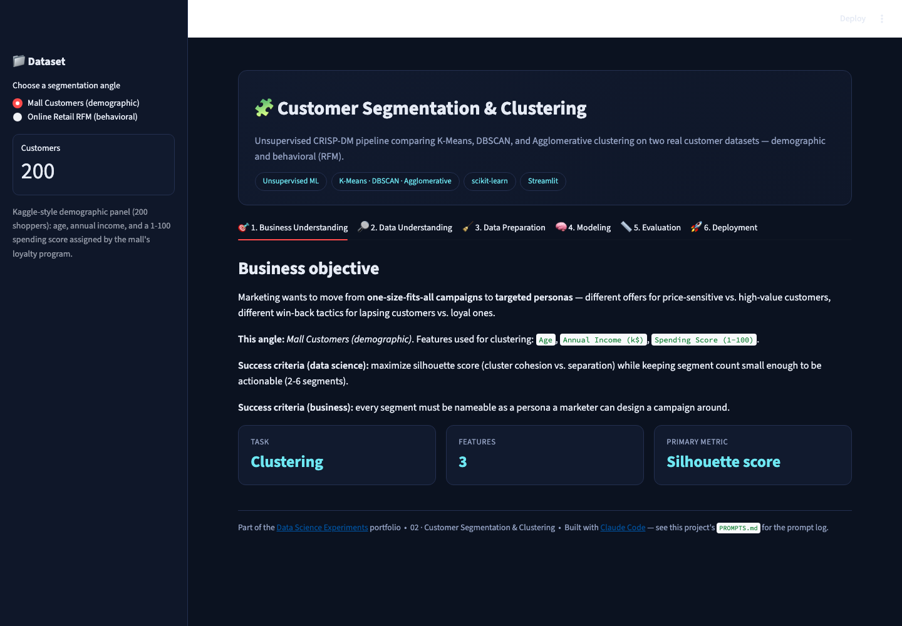
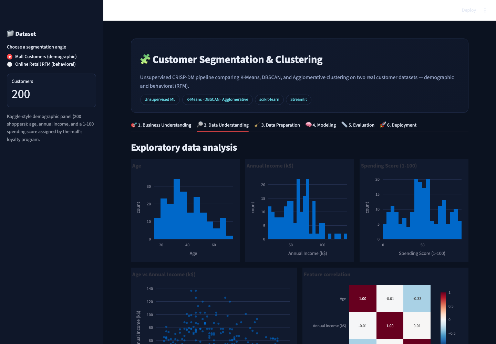
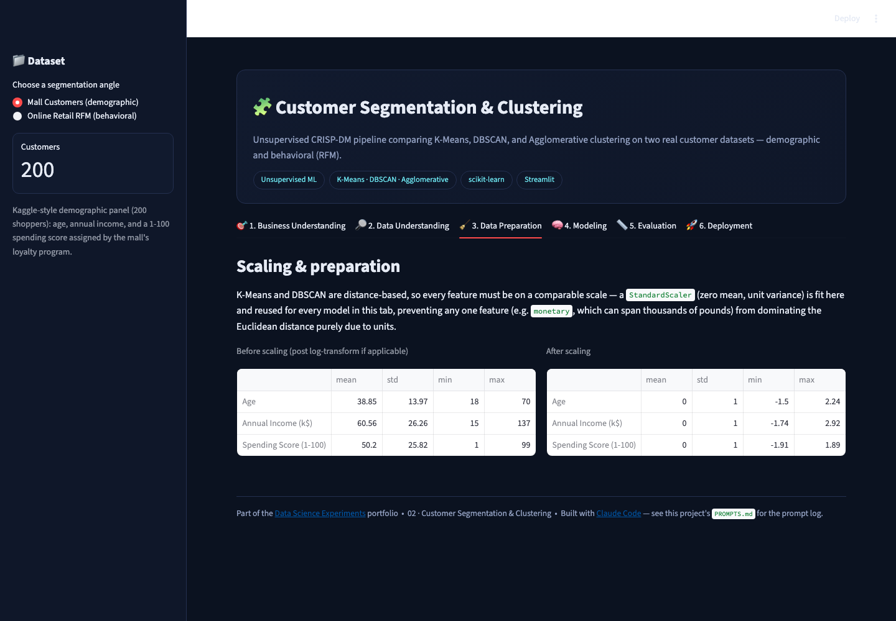
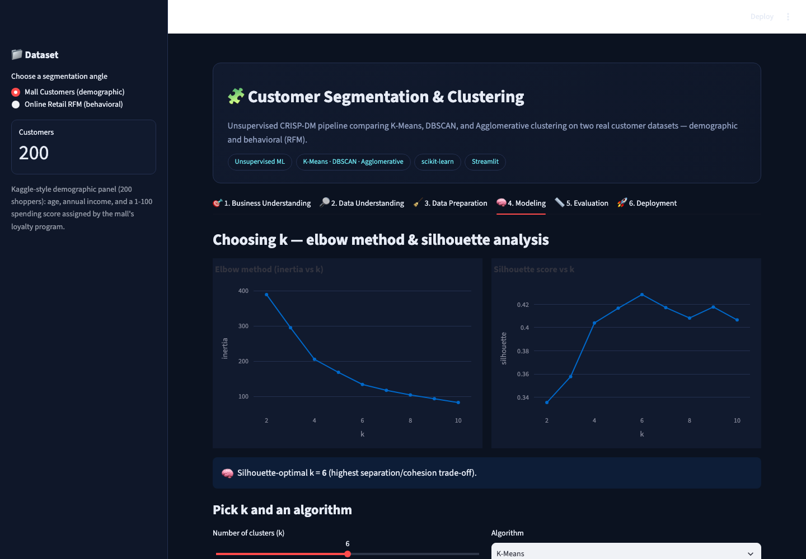
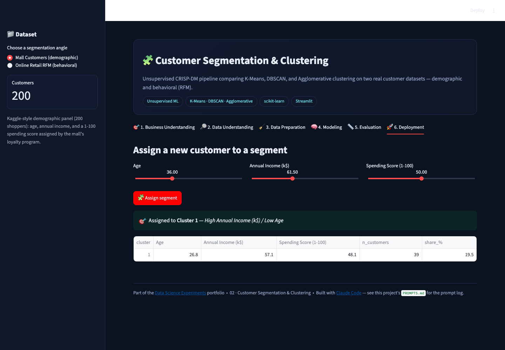

# 🧩 Customer Segmentation & Clustering

A CRISP-DM unsupervised-learning project comparing **K-Means, DBSCAN, and
Agglomerative clustering** across **two real customer datasets** — switch
between them live from the sidebar.

▶ **Run it:** `streamlit run app.py` (from this folder, with the repo's
`requirements.txt` installed) → open `http://localhost:8501`

[⬅ Back to portfolio root](../README.md) · [Prompt log](./PROMPTS.md)

---

## The business problem

Marketing wants to move from one-size-fits-all campaigns to targeted
personas — different offers for price-sensitive vs. high-value customers,
different win-back tactics for lapsing vs. loyal ones. Every segment needs
to be **nameable** — something a marketer can design a real campaign around,
not just a cluster ID.

**Primary metric:** silhouette score (cluster cohesion vs. separation),
balanced against keeping the segment count small enough to be actionable.

## Two real datasets, one app

* **Mall Customers (demographic)** — the classic 200-shopper Kaggle panel:
  `Age`, `Annual Income (k$)`, `Spending Score (1-100)`.
* **Online Retail RFM (behavioral)** — Recency / Frequency / Monetary
  aggregates derived from ~3,920 real customers in the UCI "Online Retail"
  dataset (a UK online gift retailer, Dec 2010–Dec 2011). `frequency` and
  `monetary` are heavily right-skewed (a few wholesale-scale buyers dwarf
  everyone else), so the app **log-transforms** them before scaling —
  standard RFM-segmentation practice the demographic dataset doesn't need.

## Screenshot tour

*(Mall Customers dataset shown; toggle to Online Retail RFM in the running app.)*

| Business Understanding | Data Understanding |
|---|---|
|  |  |

| Data Preparation | Modeling (elbow + silhouette) |
|---|---|
|  |  |

| Evaluation (segment personas) | Deployment (live assignment) |
|---|---|
|  |  |

## Walking through the six CRISP-DM tabs

1. **Business Understanding** — states the clustering task, the features in
   play for whichever dataset is selected, and why silhouette score (not
   inertia alone) drives the metric.
2. **Data Understanding** — per-feature histograms, a bivariate scatter, a
   correlation heatmap, and (for Mall Customers) a gender breakdown.
3. **Data Preparation** — explains and applies `StandardScaler` (fit once,
   reused everywhere in the tab) so no feature dominates Euclidean distance
   purely by unit scale; for RFM, log1p is applied to `frequency`/`monetary`
   first, with a data-driven explanation of why.
4. **Modeling** — sweeps `k = 2..10`, plotting both the elbow curve
   (inertia) and silhouette score, surfaces the silhouette-optimal `k`, and
   lets you interactively pick `k` and an algorithm (K-Means /
   Agglomerative-Ward / DBSCAN with tunable `eps`/`min_samples`) with a live
   scatter of the result.
5. **Evaluation** — a per-cluster profile table (mean feature values,
   size, share%), a normalized radar chart showing each segment's "shape,"
   and a segment-size bar chart. On Mall Customers with K-Means, k=6
   consistently recovers the textbook personas: young/high-spend,
   high-income/low-spend, high-income/high-spend ("target"), etc.
6. **Deployment** — enter a hypothetical new customer's feature values and
   get a live segment assignment plus that segment's persona label and
   profile row (K-Means only — DBSCAN/Agglomerative have no natural
   "predict on new point" operation, which the app explains rather than
   fudges).

## How it's built

* `sklearn.cluster.{KMeans, DBSCAN, AgglomerativeClustering}`,
  `sklearn.preprocessing.StandardScaler`, `sklearn.metrics.silhouette_score`.
* `@st.cache_resource` for the k-sweep (elbow/silhouette curves computed
  once per dataset+scaler); `st.session_state` carries the fitted model
  from the Modeling tab into Evaluation/Deployment within the same run.
* Both datasets flow through one shared code path (`DATASETS` config +
  `prep_matrix()`), not two parallel implementations.

## Honest limitations

* DBSCAN/Agglomerative are refit from scratch in the Modeling tab on every
  interaction — fine at this data scale (≤4k rows), not how you'd serve
  it in production.
* The RFM dataset's silhouette-optimal `k` is often small (2) because a
  small number of very-high-monetary customers still dominate even after
  log-transforming — a real, expected property of retail purchase data, not
  a bug.
