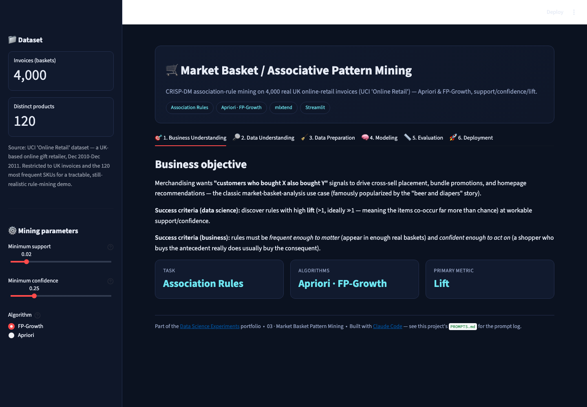
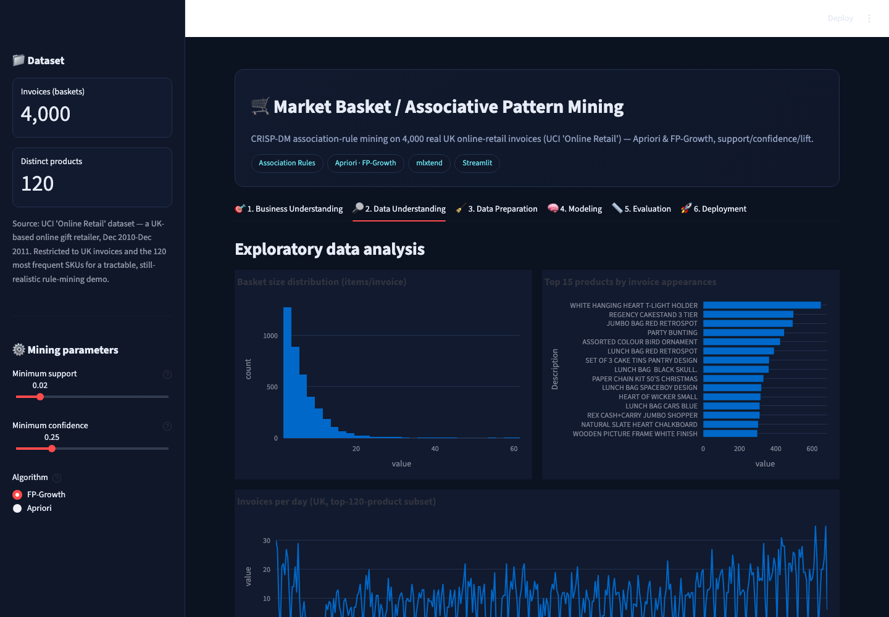
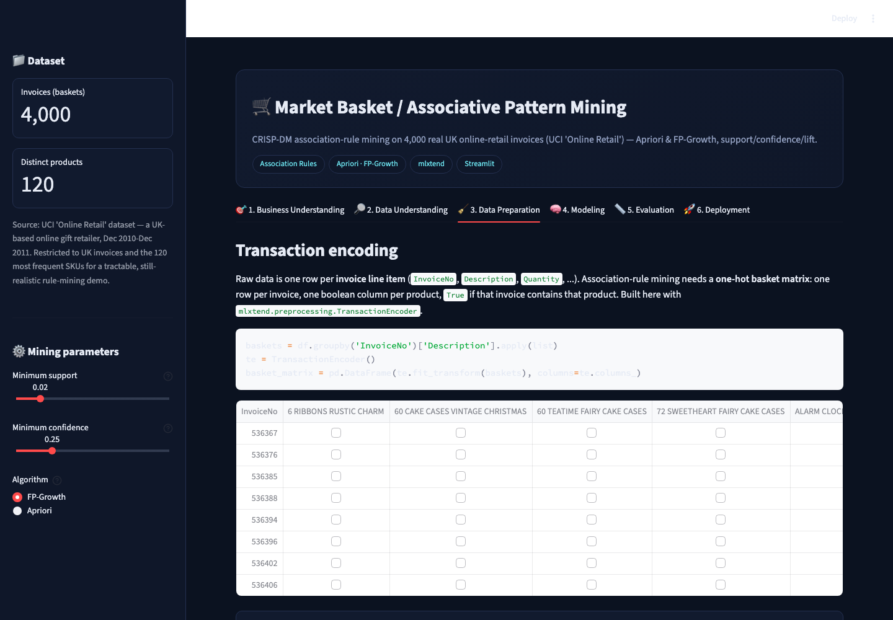
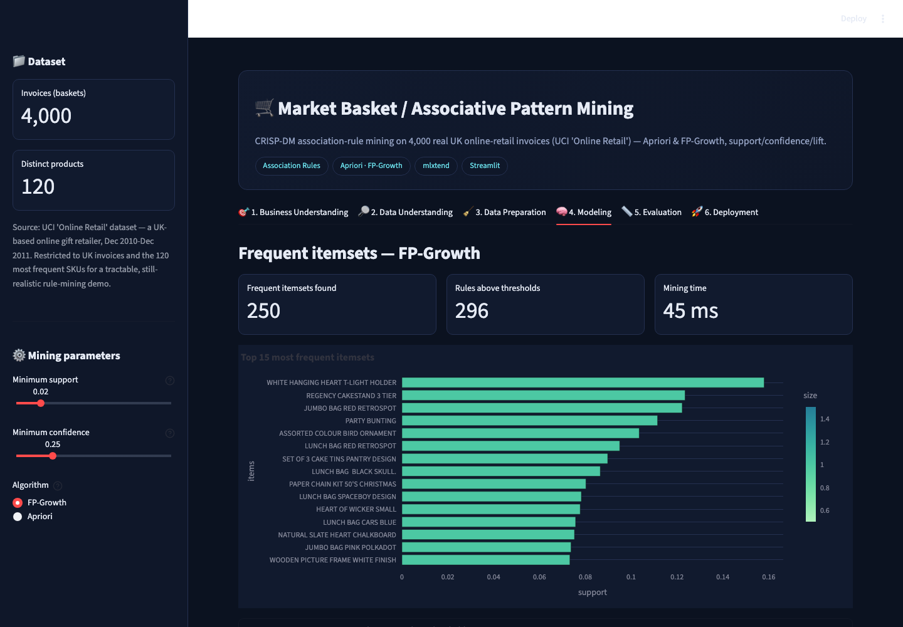
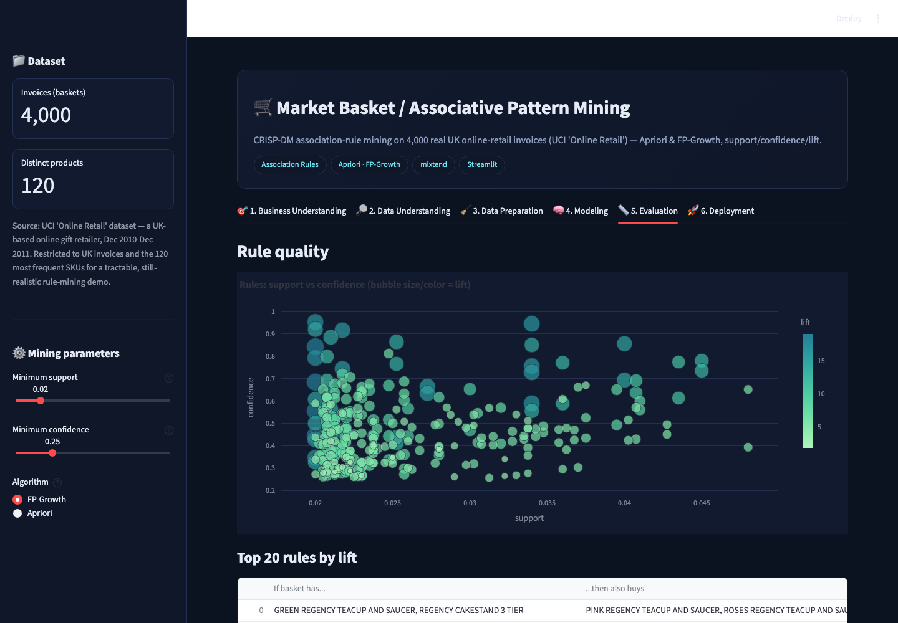

# 🛒 Market Basket / Associative Pattern Mining

A CRISP-DM association-rule-mining project on **real UK online-retail
invoices** — Apriori and FP-Growth, support/confidence/lift, and a live
"frequently bought together" recommender.

▶ **Run it:** `streamlit run app.py` (from this folder, with the repo's
`requirements.txt` installed) → open `http://localhost:8501`

[⬅ Back to portfolio root](../README.md) · [Prompt log](./PROMPTS.md)

---

## The business problem

Merchandising wants **"customers who bought X also bought Y"** signals to
drive cross-sell placement, bundle promotions, and homepage recommendations
— the classic market-basket-analysis use case popularized by the (partly
apocryphal) "beer and diapers" story.

**Primary metric:** **lift** — how much more often two items co-occur than
random chance would predict (lift > 1 means real association; lift ≫ 1
means a strong one), read alongside support (is the rule frequent enough to
matter?) and confidence (is it reliable enough to act on?).

## The dataset

4,000 real invoices (27,170 line items) from the **UCI "Online Retail"**
dataset — a UK-based online gift retailer, Dec 2010–Dec 2011 — restricted to
UK invoices and the 120 most frequent SKUs for a tractable, still-realistic
demo. See [`../_build/build_retail_datasets.py`](../_build/build_retail_datasets.py).

## Screenshot tour

| Business Understanding | Data Understanding |
|---|---|
|  |  |

| Data Preparation (basket matrix) | Modeling (frequent itemsets) |
|---|---|
|  |  |

| Evaluation (rule quality) | Deployment (live recommender) |
|---|---|
|  |  |

## Walking through the six CRISP-DM tabs

1. **Business Understanding** — states the task, the two algorithms
   compared, and why lift (not raw frequency) is the metric that matters.
2. **Data Understanding** — basket-size distribution, top-15 products by
   invoice appearances, and an invoices-per-day time series.
3. **Data Preparation** — shows the exact `TransactionEncoder` code that
   turns invoice line items into a one-hot basket matrix (one row per
   invoice, one boolean column per product), plus the resulting matrix
   density.
4. **Modeling** — mines frequent itemsets with either **Apriori** or
   **FP-Growth** at sidebar-adjustable minimum support, shows the top 15
   itemsets, and includes a live wall-clock timing comparison between the
   two algorithms at the current thresholds.
5. **Evaluation** — a support-vs-confidence bubble chart (bubble size/color
   = lift) and a top-20-rules-by-lift table. Real rules recovered from this
   data include tightly-themed sets like matching teacup/saucer/cake-stand
   china patterns — exactly the kind of coherent, explainable association a
   merchandiser would trust.
6. **Deployment** — build a cart from real product names; the app finds
   every mined rule whose antecedent is a subset of your cart, ranks
   candidate recommendations by lift, and draws a cart→recommendation graph.

## How it's built

* `mlxtend.frequent_patterns.{apriori, fpgrowth, association_rules}`,
  `mlxtend.preprocessing.TransactionEncoder`.
* `@st.cache_data` on both the basket-matrix build and the rule-mining call
  (keyed on support/confidence/algorithm), so moving the sidebar sliders
  only recomputes what actually changed.
* The recommender does real subset-matching against mined rules — it is not
  a nearest-neighbor or embedding-based recommender, so its output is fully
  explainable by the exact rule(s) that fired.

## Honest limitations

* Support/confidence thresholds that are too strict can leave zero rules for
  a given cart — the app surfaces this explicitly (rather than silently
  showing nothing) and suggests relaxing the sidebar sliders.
* Restricted to the UK market and top-120 SKUs for tractability; the full
  UCI dataset spans many more countries and products.
