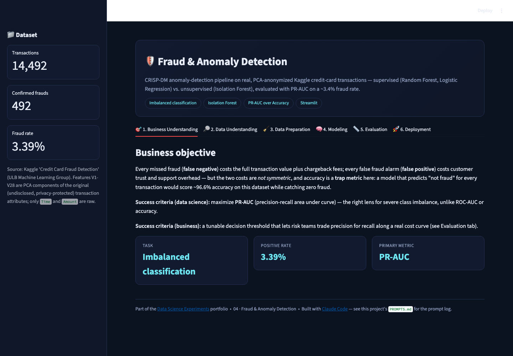
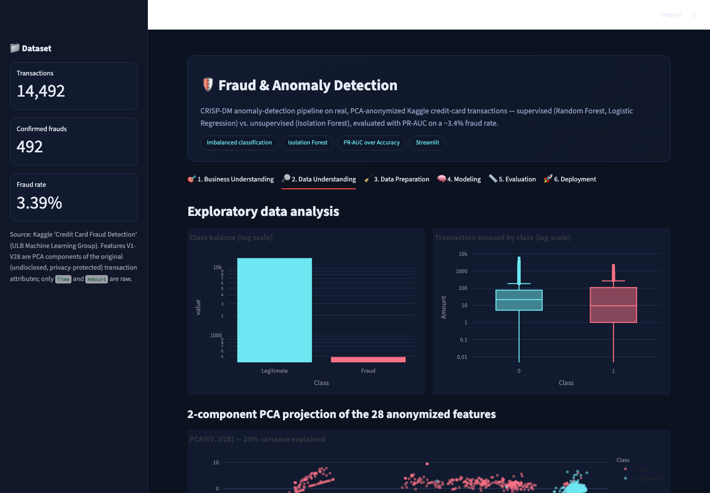
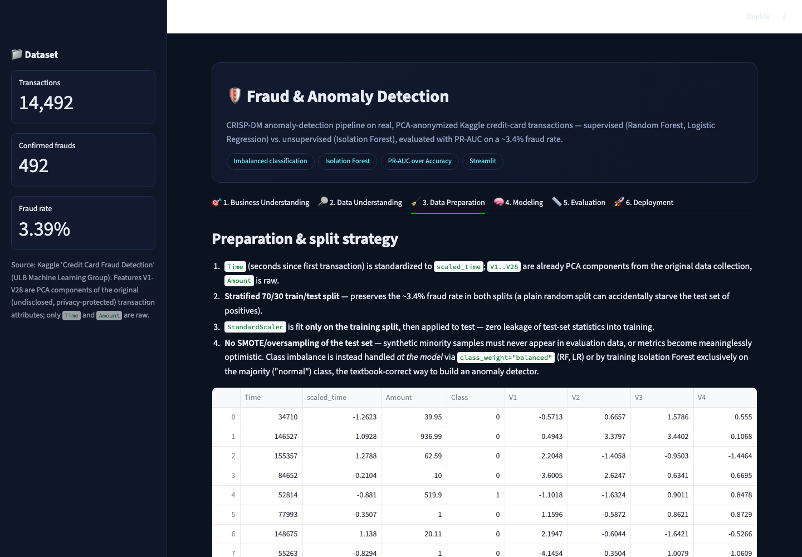
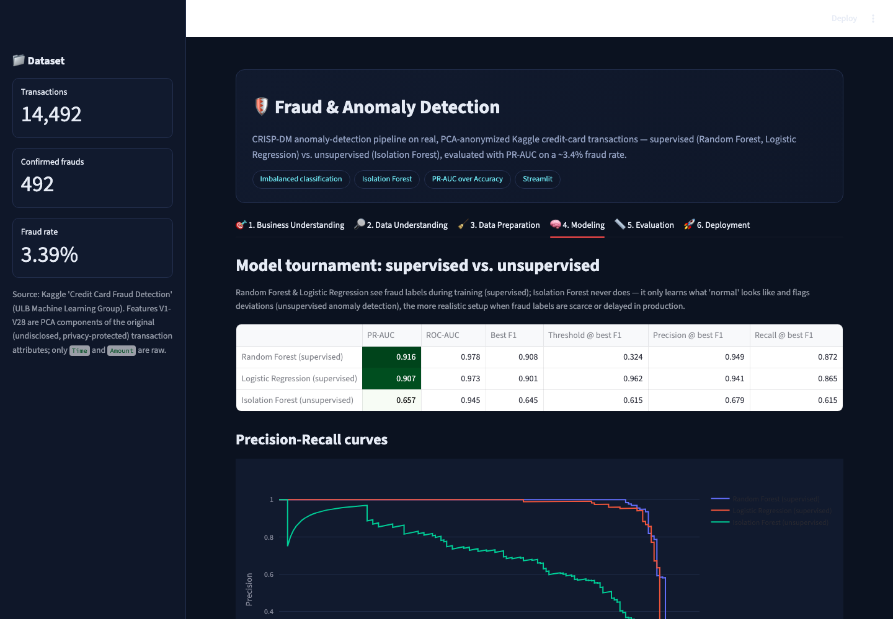
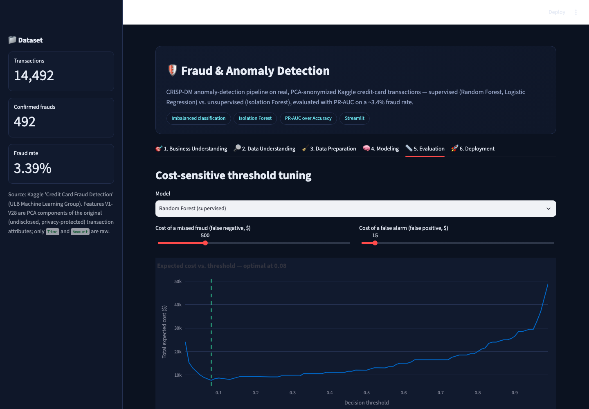

# 🛡️ Fraud & Anomaly Detection

A CRISP-DM anomaly-detection project on the real, PCA-anonymized **Kaggle
Credit Card Fraud Detection** dataset — supervised models vs. a true
unsupervised anomaly detector, evaluated the way a severely imbalanced
problem actually should be.

▶ **Run it:** `streamlit run app.py` (from this folder, with the repo's
`requirements.txt` installed) → open `http://localhost:8501`

[⬅ Back to portfolio root](../README.md) · [Prompt log](./PROMPTS.md)

---

## The business problem

Every missed fraud (false negative) costs the full transaction value plus
chargeback fees; every false alarm (false positive) costs customer trust and
support overhead — and the two costs are **not symmetric**. Accuracy is a
trap metric here: a model that predicts "not fraud" for *every* transaction
scores ~96.6% accuracy on this dataset while catching zero fraud.

**Primary metric:** **PR-AUC** (precision-recall area under curve) — the
correct lens for severe class imbalance, unlike ROC-AUC or accuracy, plus a
**cost-sensitive decision threshold** the Evaluation tab lets you tune
directly against dollar costs.

## The dataset

14,492 real transactions (Kaggle / ULB Machine Learning Group "Credit Card
Fraud Detection"), including **every one of the 492 confirmed frauds** in
the original dataset, stratified down from the full 284,807-row release to
keep the repo lightweight (~3.4% fraud rate here vs. ~0.17% in the original
— see [`../_build/build_fraud_dataset.py`](../_build/build_fraud_dataset.py)).
Features `V1..V28` are PCA components of the original (privacy-protected,
never disclosed) transaction attributes; only `Time` and `Amount` are raw.

## Screenshot tour

| Business Understanding | Data Understanding (PCA separation) |
|---|---|
|  |  |

| Data Preparation | Modeling (model tournament) |
|---|---|
|  |  |

| Evaluation (cost-optimal threshold) | Deployment (live scoring) |
|---|---|
|  |  |

## Walking through the six CRISP-DM tabs

1. **Business Understanding** — the asymmetric-cost framing above, plus why
   PR-AUC (not accuracy) is the number that matters here.
2. **Data Understanding** — class balance on a log scale (492 vs. 14,000),
   transaction amount by class, and a 2-component PCA projection of the 28
   anonymized features that already visibly separates fraud from legitimate
   traffic — a strong early signal the problem is learnable.
3. **Data Preparation** — a **stratified** 70/30 split (preserving the fraud
   rate in both splits — a plain random split can starve the test set of
   positives), a `StandardScaler` fit only on training data, and an explicit
   note on why the test set is **never** oversampled (synthetic minority
   samples in evaluation data would make metrics meaninglessly optimistic).
4. **Modeling** — a real three-way tournament: **Random Forest** and
   **Logistic Regression** (both `class_weight="balanced"`, supervised, see
   fraud labels during training) against **Isolation Forest** (trained
   *only* on the non-fraud class, the textbook-correct way to build an
   unsupervised anomaly detector). On this run, Random Forest leads at
   **PR-AUC ≈ 0.92** vs. Isolation Forest's **≈ 0.66** — the honest gap
   between "has labels" and "genuinely unsupervised."
5. **Evaluation** — an interactive expected-cost-vs-threshold curve: set the
   dollar cost of a missed fraud and of a false alarm, and the app finds and
   visualizes the threshold that minimizes total expected cost, then shows
   the resulting confusion matrix, recall, and precision at that threshold.
6. **Deployment** — score either a real held-out transaction (with its
   ground-truth label shown for teaching purposes) or a manually-constructed
   one (Amount + the model's top predictive features), returning both the
   Random Forest fraud probability and the Isolation Forest anomaly score
   side by side, plus a gauge visualization.

## How it's built

* `sklearn.ensemble.{RandomForestClassifier, IsolationForest}`,
  `sklearn.linear_model.LogisticRegression`,
  `sklearn.metrics.{average_precision_score, precision_recall_curve, ...}`.
* `@st.cache_resource` for the full train step (all three models trained
  once per process); the Isolation Forest is explicitly fit on
  `X_train[y_train == 0]` only — it never sees a fraud label.
* Cost-threshold search sweeps 99 candidate thresholds and picks the
  argmin of `fn_count * fn_cost + fp_count * fp_cost` — a direct, readable
  implementation of cost-sensitive decisioning rather than a black-box
  optimizer.

## Honest limitations

* This is a stratified *sample* of the original 284,807-row dataset (chosen
  to keep the repo under a few MB) — absolute metric values will differ
  slightly from papers/kernels trained on the full release, though the
  relative model ranking and the PR-AUC-vs-accuracy story hold either way.
* `V1..V28` are anonymized PCA components with no real-world meaning, so the
  "Manual" scoring mode's sliders are labeled by column name only — this is
  a faithful constraint of the public dataset, not a simplification made
  here.
