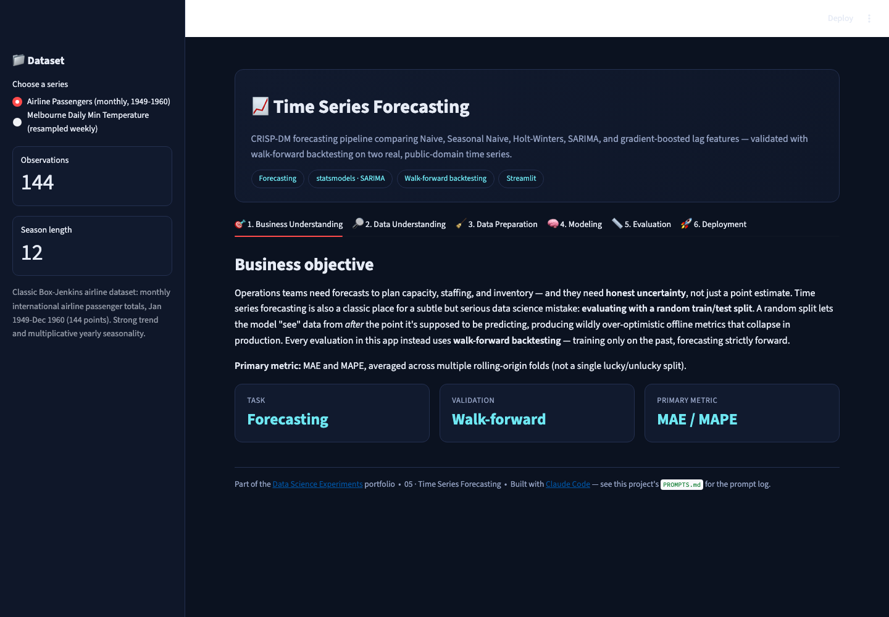
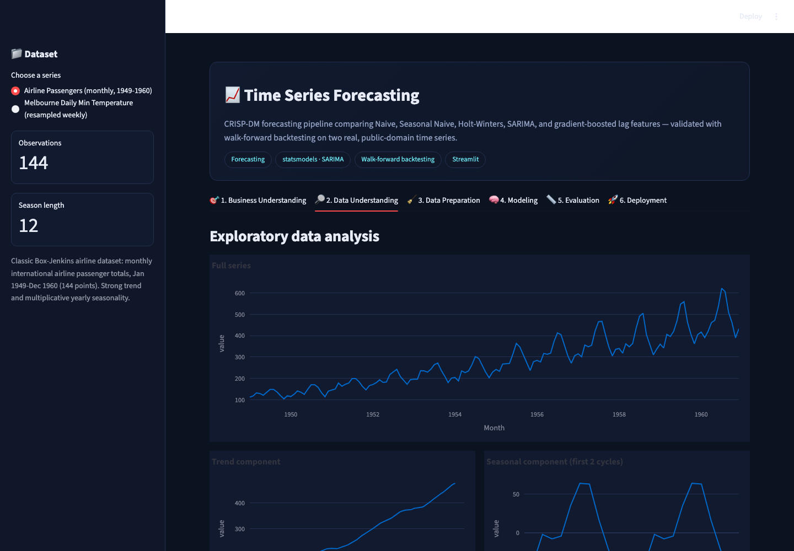
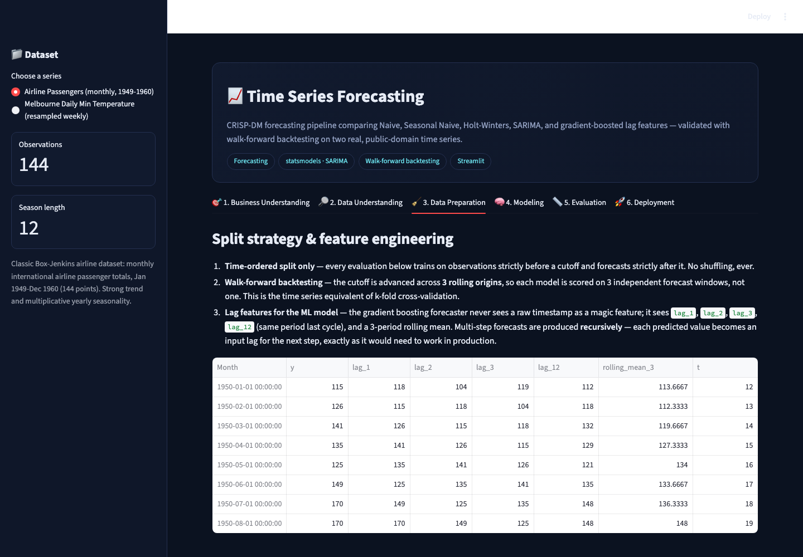
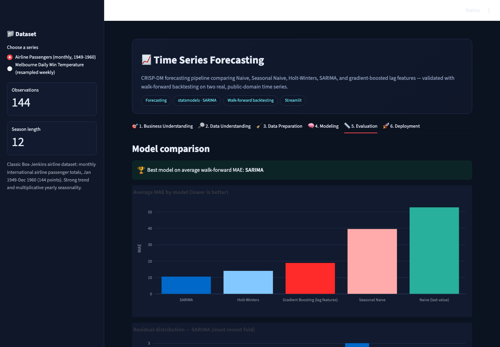
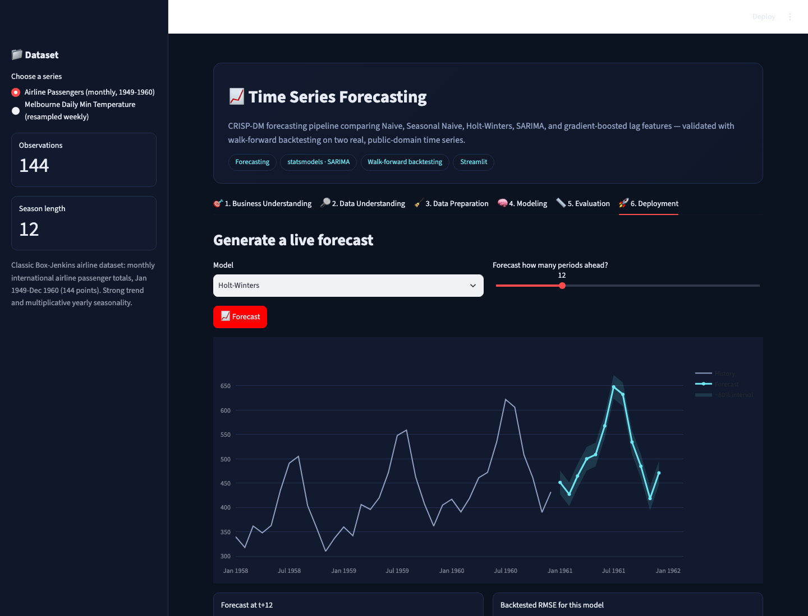

# 📈 Time Series Forecasting

A CRISP-DM forecasting project comparing **Naive, Seasonal Naive,
Holt-Winters, SARIMA, and a lag-feature Gradient Boosting regressor** on two
real, public-domain time series — validated the way time series always
should be: **walk-forward backtesting**, never a random split.

▶ **Run it:** `streamlit run app.py` (from this folder, with the repo's
`requirements.txt` installed) → open `http://localhost:8501`

[⬅ Back to portfolio root](../README.md) · [Prompt log](./PROMPTS.md)

---

## The business problem

Operations teams need forecasts to plan capacity, staffing, and inventory —
and honest uncertainty, not just a point estimate. Time series forecasting
is also a classic place for a subtle-but-serious mistake: evaluating with a
**random** train/test split, which lets a model "see" values from after the
point it's supposed to be predicting. Every evaluation in this app instead
uses **walk-forward backtesting** across 3 rolling origins.

**Primary metric:** MAE and MAPE, averaged across folds.

## The datasets

* **Airline Passengers** — the classic Box-Jenkins dataset: monthly
  international airline passenger totals, Jan 1949–Dec 1960 (144 points),
  strong trend and multiplicative yearly seasonality.
* **Melbourne Daily Minimum Temperature** — 3,650 real daily readings,
  1981–1990, resampled to weekly means (52-week seasonality) so SARIMA
  stays tractable in a browser demo; the underlying readings are real and
  unmodified.

## Screenshot tour

| Business Understanding | Data Understanding (decomposition + ACF/PACF) |
|---|---|
|  |  |

| Data Preparation | Modeling (walk-forward tournament) |
|---|---|
|  |  |

| Evaluation | Deployment (live forecast) |
|---|---|
|  |  |

## Walking through the six CRISP-DM tabs

1. **Business Understanding** — the leakage-via-random-split trap, and why
   walk-forward backtesting is the correct alternative.
2. **Data Understanding** — the full series, an additive seasonal
   decomposition (trend/seasonal components), and ACF/PACF plots.
3. **Data Preparation** — time-ordered splitting only, walk-forward with 3
   rolling origins, and the exact lag-feature set (`lag_1`, `lag_2`,
   `lag_3`, `lag_{season_length}`, 3-period rolling mean) the ML forecaster
   trains on — with **recursive** multi-step forecasting (each prediction
   feeds the next step's lags, exactly as production would require).
4. **Modeling** — a real 5-way tournament. On Airline Passengers,
   **SARIMA** wins clearly (~10.6 MAE, ~3.2% MAPE) over Holt-Winters (~14.1
   MAE) and the ML forecaster (~18.9 MAE) — both comfortably beating the
   naive baselines.
5. **Evaluation** — average MAE by model, and a residual histogram for the
   winner.
6. **Deployment** — pick a model and a horizon, get a live forecast with an
   ~80% uncertainty band derived from that model's own backtested RMSE.

## How it's built

* `statsmodels` for `ExponentialSmoothing` (Holt-Winters), `SARIMAX`, and
  `seasonal_decompose`/`acf`/`pacf`; `sklearn.ensemble.GradientBoostingRegressor`
  for the ML forecaster.
* `@st.cache_data` for the walk-forward backtest (keyed on dataset + horizon)
  so moving the horizon slider doesn't silently reuse a stale backtest.
* The weekly-resampled temperature series exists specifically so SARIMA's
  seasonal order stays computationally tractable (`m=52` instead of `m=365`
  on daily data, which would be far too slow for an interactive demo) —
  documented explicitly rather than hidden.

## Honest limitations

* SARIMA's order `(1,1,1)x(1,1,0,m)` is fixed rather than grid-searched
  per dataset (a full `auto_arima`-style search would be slower than fits
  an interactive demo) — it happens to work well on both series here, but a
  production system would search orders properly.
* The ~80% forecast interval in the Deployment tab is a simple
  `point ± 1.28·RMSE` band from backtested residuals, not each model's own
  native (and generally tighter/better-calibrated) prediction interval.
