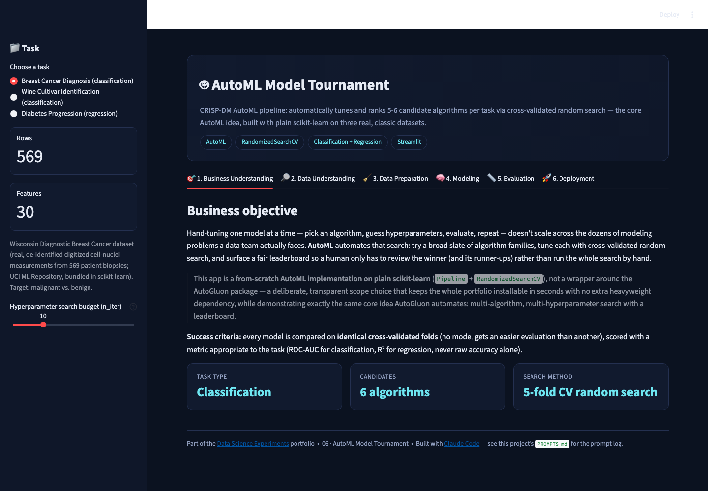
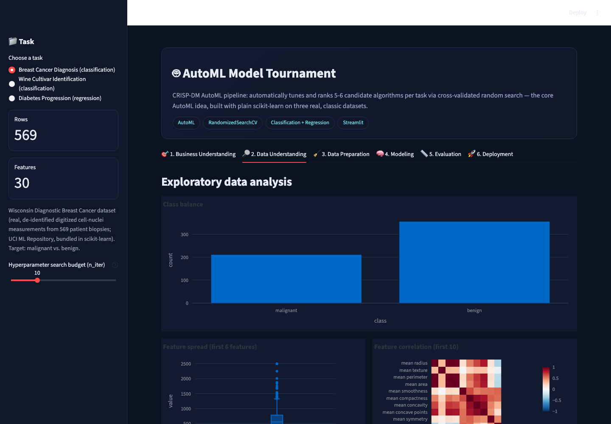
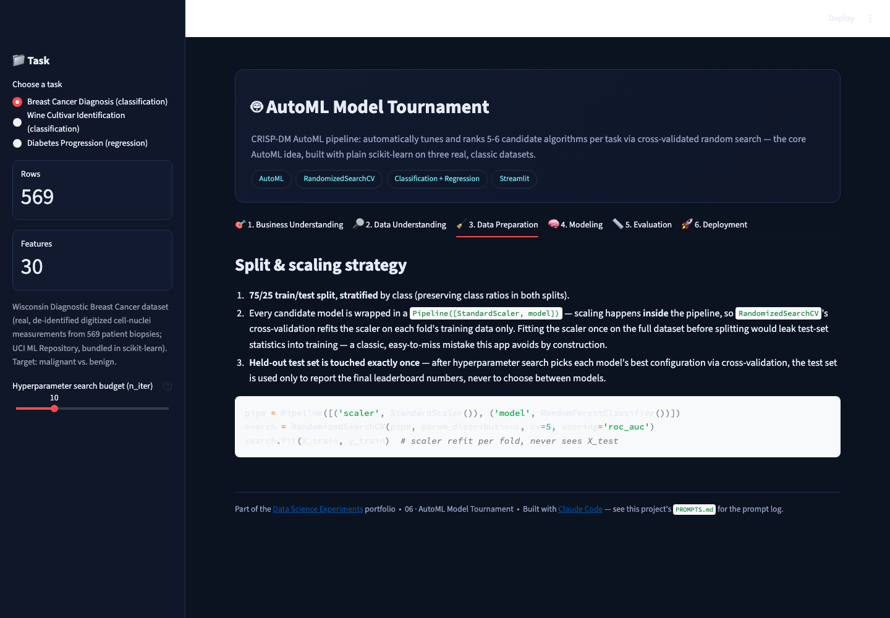
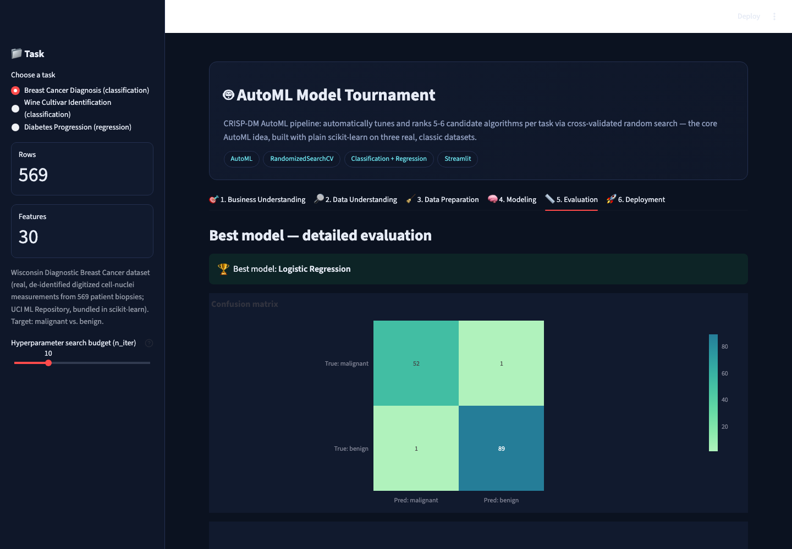
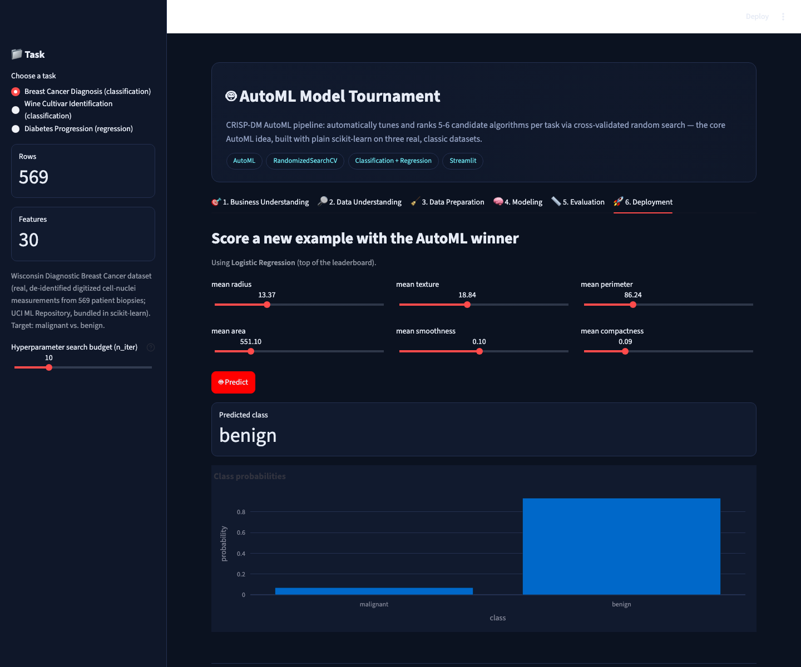

# 🤖 AutoML Model Tournament

A CRISP-DM AutoML project: automatically tune and rank **5-6 candidate
algorithms** per task with cross-validated random search — the core idea
behind AutoGluon/H2O AutoML/auto-sklearn, reimplemented on plain
scikit-learn so it installs in seconds. Works across **three real, classic
datasets** spanning both classification and regression.

▶ **Run it:** `streamlit run app.py` (from this folder, with the repo's
`requirements.txt` installed) → open `http://localhost:8501`

[⬅ Back to portfolio root](../README.md) · [Prompt log](./PROMPTS.md)

---

## The business problem

Hand-tuning one model at a time — pick an algorithm, guess hyperparameters,
evaluate, repeat — doesn't scale across the dozens of modeling problems a
real data team faces. AutoML automates that search and surfaces a fair
leaderboard so a human reviews the winner instead of running the search by
hand.

**Primary metric:** ROC-AUC (classification) or R² (regression) via 5-fold
cross-validation — every candidate model is scored on *identical* folds.

## A transparent scope choice

This is a **from-scratch AutoML implementation on plain scikit-learn**
(`Pipeline` + `RandomizedSearchCV`), not a wrapper around the AutoGluon
package the original source-repo prompt names. That's a deliberate choice,
documented here rather than hidden: it keeps the whole portfolio
installable in seconds with no heavyweight extra dependency, while
demonstrating exactly the same core mechanic AutoGluon automates —
multi-algorithm, multi-hyperparameter search with a leaderboard.

## The datasets

Three real datasets bundled directly in scikit-learn (no download needed):
**Wisconsin Diagnostic Breast Cancer** (569 patient biopsies, binary
classification), **Wine cultivar identification** (178 real wine chemical
analyses, 3-class classification), and **Diabetes progression** (442 real
patients, regression).

## Screenshot tour

| Business Understanding | Data Understanding |
|---|---|
|  |  |

| Data Preparation | Modeling (leaderboard) |
|---|---|
|  |  |

| Evaluation | Deployment (live scoring) |
|---|---|
|  |  |

## Walking through the six CRISP-DM tabs

1. **Business Understanding** — states the AutoGluon-vs-scikit-learn scope
   decision above, up front and honestly.
2. **Data Understanding** — class balance / target distribution, feature
   spread, and a correlation heatmap for whichever task is selected.
3. **Data Preparation** — a stratified (classification) or plain
   (regression) 75/25 split, and why scaling lives *inside* each pipeline
   (so cross-validation refits it per fold, never leaking test-set
   statistics into training).
4. **Modeling** — the leaderboard: on Breast Cancer, Logistic Regression
   and an SVM tie at the top (~0.994 CV ROC-AUC), both edging out Random
   Forest and Gradient Boosting — a genuinely useful, slightly
   counter-intuitive result (the simplest model wins) that a real AutoML
   run would also surface. A search-cost chart shows the wall-clock
   time/quality trade-off per model.
5. **Evaluation** — confusion matrix + ROC curve (classification) or
   predicted-vs-actual (regression) for the leaderboard winner, plus
   feature importances where the winning model supports them.
6. **Deployment** — score a new example with the AutoML-selected winner
   live, feature sliders included.

## How it's built

* `sklearn.model_selection.RandomizedSearchCV` over `scipy.stats`
  distributions (`randint`/`uniform`), 5-fold CV, `n_iter` adjustable from
  the sidebar (default 10) — a direct trade-off slider between search
  thoroughness and wall-clock time.
* Every candidate is a `Pipeline([StandardScaler, model])`, so
  hyperparameter search and scaling are cross-validated together correctly.
* `@st.cache_resource` on the whole tournament, keyed on task + search
  budget, so switching tabs doesn't silently re-run the search.

## Honest limitations

* `RandomizedSearchCV` with a small `n_iter` is a lighter search than a
  real AutoML system's — it's tuned for interactive-demo speed, not
  competition-grade leaderboard performance.
* Only 3 datasets are wired up; a production AutoML tool would also handle
  missing values, categorical encoding, and dataset-specific feature
  engineering automatically, none of which these three clean, bundled
  datasets require.
