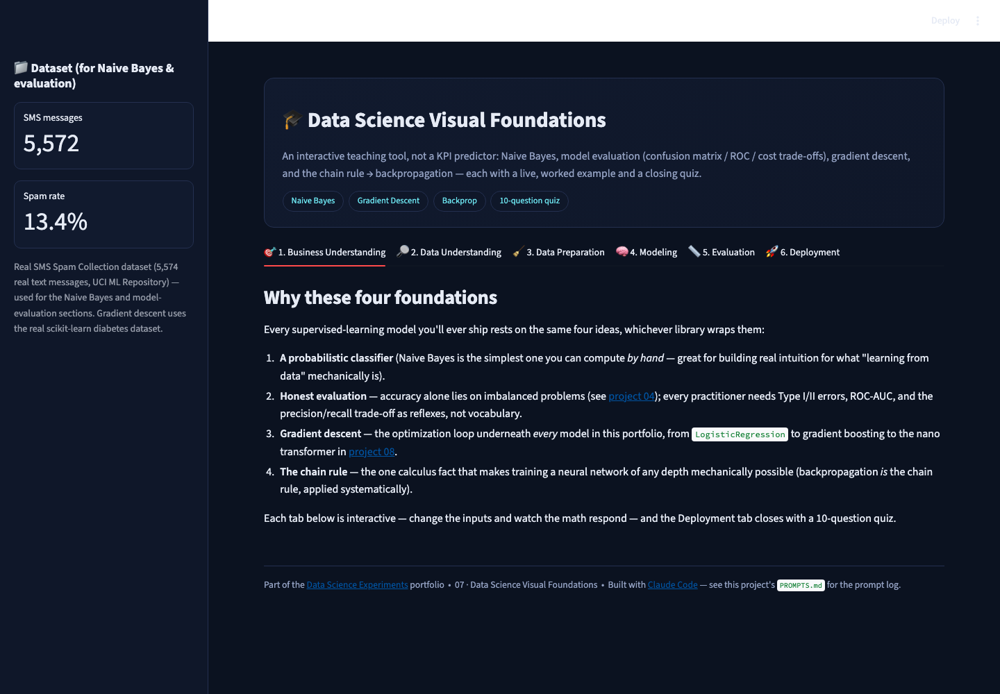
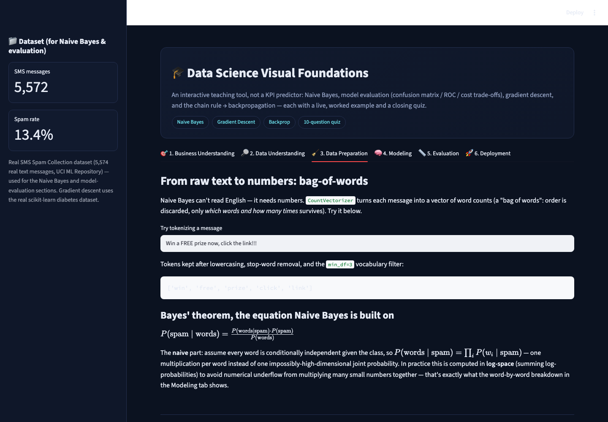
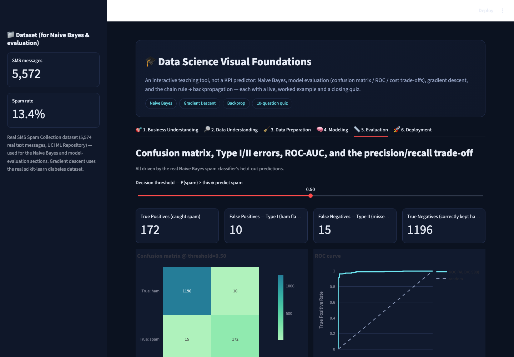
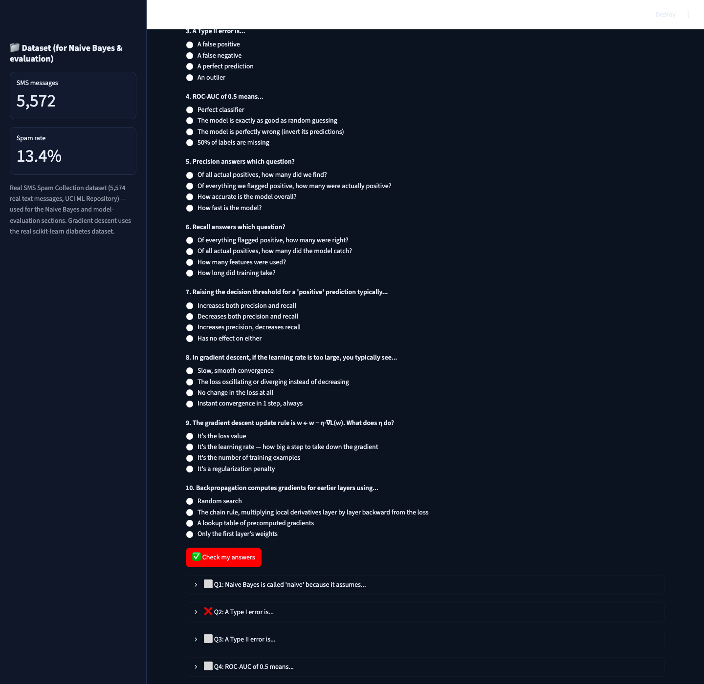

# 🎓 Data Science Visual Foundations

Not a business-KPI predictor — a **teaching tool**. Four foundational
concepts every data scientist needs deep intuition for, each interactive
and grounded in real data or a fully worked numeric example, closing with a
10-question interview-prep quiz.

▶ **Run it:** `streamlit run app.py` (from this folder, with the repo's
`requirements.txt` installed) → open `http://localhost:8501`

[⬅ Back to portfolio root](../README.md) · [Prompt log](./PROMPTS.md)

---

## What this teaches

1. **Naive Bayes** — a live spam filter trained on the real SMS Spam
   Collection dataset, with a **word-by-word log-probability breakdown**
   of exactly why a message is classified spam or ham — the actual
   arithmetic, not a black box.
2. **Model evaluation** — confusion matrix, Type I/II errors, ROC-AUC, a
   cost matrix, and the precision/recall trade-off, all driven by one
   interactive decision-threshold slider on real classifier scores.
3. **Gradient descent** — a real 1-feature linear regression (diabetes BMI
   → disease progression, from the real scikit-learn diabetes dataset) fit
   live via manual gradient descent, with the loss surface, descent path,
   and per-iteration loss curve all visible — turn the learning rate up
   until it visibly diverges.
4. **The chain rule → backpropagation** — a fully worked, numerically
   transparent forward + backward pass through a 1-1-1 neuron network,
   every intermediate derivative shown in a table.

## The dataset

The real **SMS Spam Collection** dataset (5,574 real text messages, UCI ML
Repository) drives the Naive Bayes and evaluation sections. Gradient
descent uses the real scikit-learn diabetes dataset. Nothing here is
synthetic data pretending to be real — the calculus/backprop section uses a
fully worked closed-form numeric example instead, exactly as a textbook
would.

## Screenshot tour

| Business Understanding (learning objectives) | Data Understanding (spam EDA) |
|---|---|
|  |  |

| Data Preparation (bag-of-words + Bayes' theorem) | Modeling (NB explainer + gradient descent + backprop) |
|---|---|
|  |  |

| Evaluation (confusion matrix / ROC / cost trade-off) | Deployment (10-question quiz) |
|---|---|
|  |  |

## Walking through the six tabs

1. **Business Understanding** — why these four ideas underpin every model
   in this portfolio, from Naive Bayes' Bayes'-theorem foundation to the
   gradient descent loop inside every `sklearn` model to the chain rule
   powering [project 08](../08_nano_transformer_llm)'s backprop.
2. **Data Understanding** — spam/ham class balance, message-length
   distribution by class, and the top words by log P(word | spam).
3. **Data Preparation** — a live bag-of-words tokenizer you can type into,
   plus Bayes' theorem and the conditional-independence assumption that
   makes Naive Bayes "naive," rendered in LaTeX.
4. **Modeling** — three live simulators in one tab: the Naive Bayes
   word-by-word breakdown, an interactive gradient-descent loss-surface
   visualizer (turn up the learning rate and watch it diverge), and the
   backprop chain-rule worked example.
5. **Evaluation** — a real precision/recall trade-off you can feel: drag
   the threshold and watch Type I errors (false alarms) trade against Type
   II errors (missed spam), plus a cost-matrix calculator.
6. **Deployment** — the closing quiz: 10 multiple-choice, interview-style
   questions across all four topics, each with an explanation revealed
   after checking your answers.

## How it's built

* `sklearn.feature_extraction.text.CountVectorizer` +
  `sklearn.naive_bayes.MultinomialNB`, with `feature_log_prob_` read
  directly to build the word-by-word explanation — no extra explainability
  library needed, because Naive Bayes' math *is* directly interpretable.
* Gradient descent and the backprop example are both **hand-written numpy**
  (no autograd) specifically so every number on screen is traceable to a
  formula in the README/code, not a framework internal.
* The quiz uses `st.session_state`-free `st.radio(..., index=None)` widgets
  plus a single "check answers" pass — deliberately simple, no external
  quiz library.

## Honest limitations

* The gradient descent demo fixes the model to a single feature
  (`bmi → progression`) for a visualizable 2D loss surface `(w, b)` — real
  regressions have far higher-dimensional loss surfaces that can't be
  plotted this way, a limitation the tab doesn't try to hide.
* The backprop example is a 1-1-1 network for full numeric transparency;
  it does not scale up to show a multi-layer/multi-neuron backward pass,
  which would require summing gradients across paths rather than one
  linear chain.
