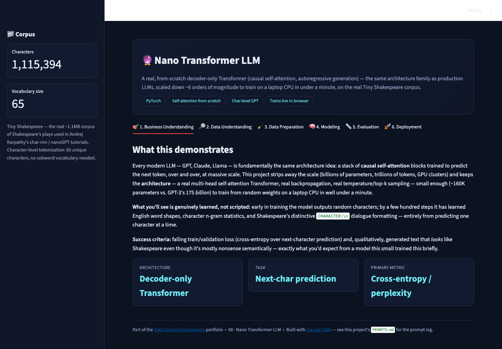
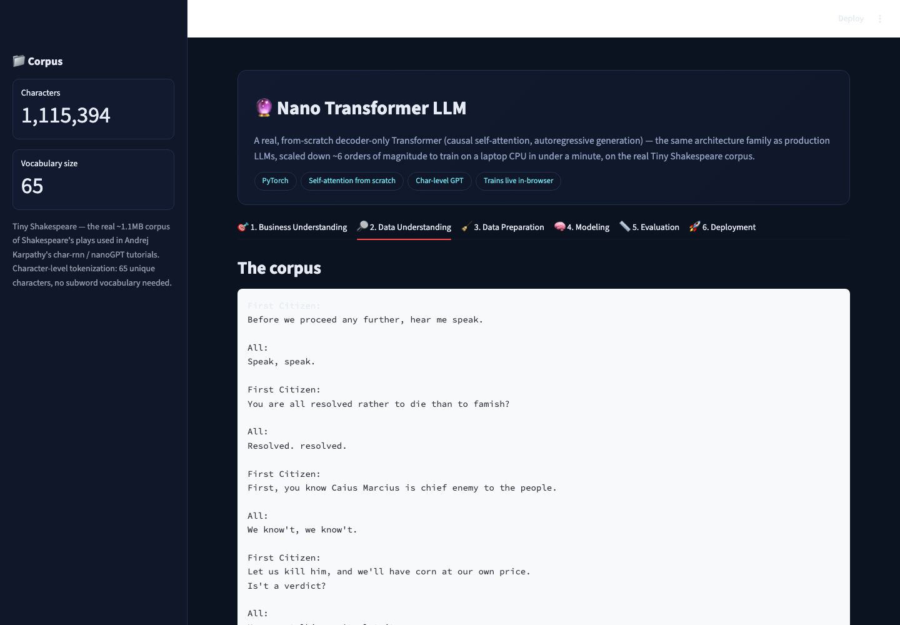
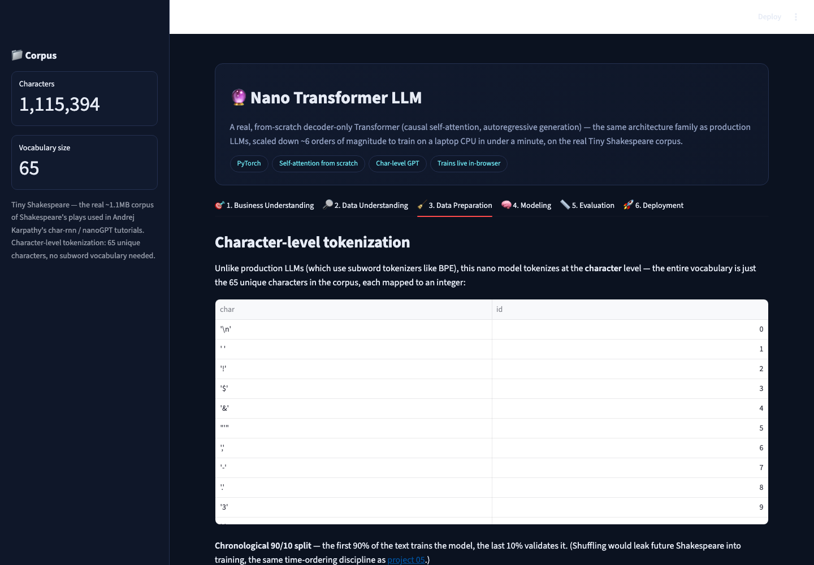
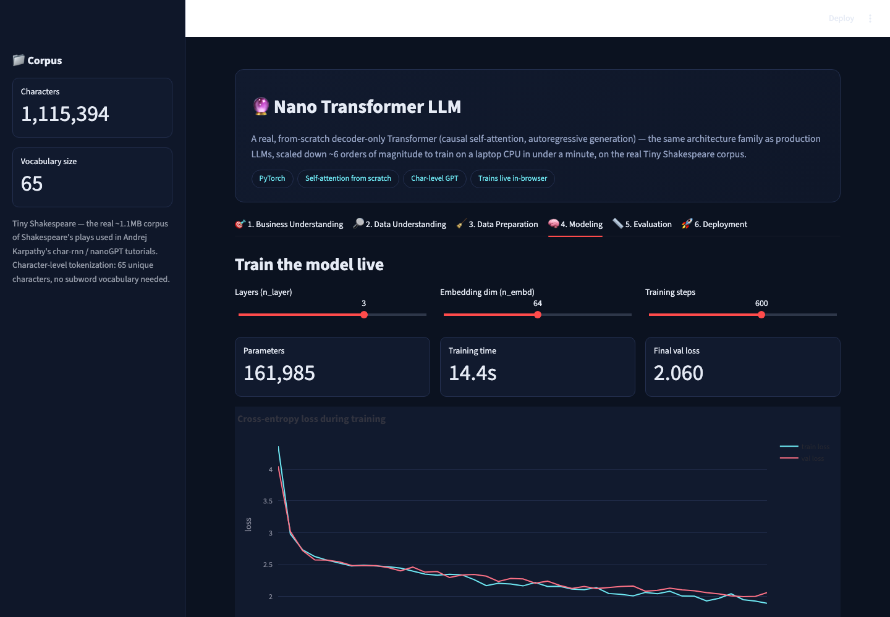

# 🔮 Nano Transformer LLM

A real, from-scratch **decoder-only Transformer** — causal self-attention,
autoregressive next-token prediction, the same architecture family as
production LLMs — scaled down ~6 orders of magnitude (~160K parameters vs.
GPT-3's 175 billion) so it trains from random initialization on a laptop
CPU **in under a minute**, on the real Tiny Shakespeare corpus.

▶ **Run it:** `streamlit run app.py` (from this folder, with the repo's
`requirements.txt` installed, **plus** `pip install torch --index-url
https://download.pytorch.org/whl/cpu`) → open `http://localhost:8501`

[⬅ Back to portfolio root](../README.md) · [Prompt log](./PROMPTS.md)

---

## What this demonstrates

Every modern LLM is fundamentally the same idea: a stack of causal
self-attention blocks trained to predict the next token, over and over, at
massive scale. This project keeps the **architecture** — real multi-head
self-attention (`Q`, `K`, `V` projections, causal masking, softmax
attention weights), real backpropagation through `PyTorch` autograd, real
temperature/top-k sampling — and strips away the scale, so training and
generation both happen live, in the browser, on CPU.

**Primary metric:** validation cross-entropy / perplexity over
next-character prediction.

## The dataset

**Tiny Shakespeare** — the real ~1.1MB corpus of Shakespeare's plays that
Andrej Karpathy's char-rnn/nanoGPT tutorials made famous. Tokenized at the
**character** level (65 unique characters — no subword vocabulary needed at
this scale).

## Screenshot tour

| Business Understanding | Data Understanding |
|---|---|
|  |  |

| Data Preparation (tokenization) | Modeling (train live) |
|---|---|
|  |  |

| Evaluation (perplexity + attention map) | Deployment (generate text) |
|---|---|
|  |  |

## Walking through the six CRISP-DM tabs

1. **Business Understanding** — the scale comparison above, and what
   "genuinely learned, not scripted" means for a model this small.
2. **Data Understanding** — a raw corpus excerpt and a character-frequency
   chart.
3. **Data Preparation** — the char→int vocabulary, a chronological 90/10
   train/val split (no shuffling — this project keeps the same
   time-ordering discipline as [project 05](../05_time_series_forecasting)),
   and exactly how `(x, y)` training pairs are sampled (`y` = `x` shifted
   one character forward).
4. **Modeling** — pick layers / embedding dimension / training steps and
   click through: the model trains **live**, in front of you, with a real
   train/validation loss curve. Random-init loss starts near `ln(65) ≈
   4.17`; a default 600-step run typically lands validation loss around
   ~2.0-2.2 in well under 15 seconds on CPU.
5. **Evaluation** — validation perplexity, and a genuine mechanistic-
   interpretability touch: an **attention-weight heatmap** for one head on
   a sample sentence, showing the causal (lower-triangular) masking
   structure directly.
6. **Deployment** — type a prompt, set temperature/top-k, generate text
   live. Expect Shakespeare-*flavored* gibberish — real word shapes, real
   `CHARACTER:\n` dialogue formatting, not coherent plot — exactly what a
   160K-parameter model trained for under a minute should produce.

## How it's built

* Pure `torch.nn` — `Head` (single attention head), `MultiHead`,
  `FeedForward`, `Block` (pre-norm residual, attention + MLP), and
  `NanoGPT` (token + positional embeddings → N blocks → final layer norm →
  linear head), all written out explicitly rather than imported from a
  library, so every line is inspectable.
* `@st.cache_resource` on the trained model, keyed on architecture
  hyperparameters + step count, so the Evaluation/Deployment tabs reuse the
  Modeling tab's trained weights instead of retraining on every click.
* `generate()` implements temperature scaling and top-k filtering by hand
  on the logits before `torch.multinomial` sampling — the same sampling
  mechanics (simplified) that real LLM inference servers use.

## Honest limitations

* This is genuinely tiny — 65-character vocabulary, ≤128-dim embeddings,
  ≤4 layers, a 64-character context window, trained for at most ~1,500
  steps. It demonstrates the *architecture*, not competitive text quality;
  the README and in-app copy say so directly rather than overselling
  sample outputs.
* `torch` is the one dependency in this whole portfolio not pinned in the
  shared root `requirements.txt` by default (it's called out separately)
  because it's needed only by this project and the CPU-only wheel must be
  installed from PyTorch's own index for a small, fast download.
