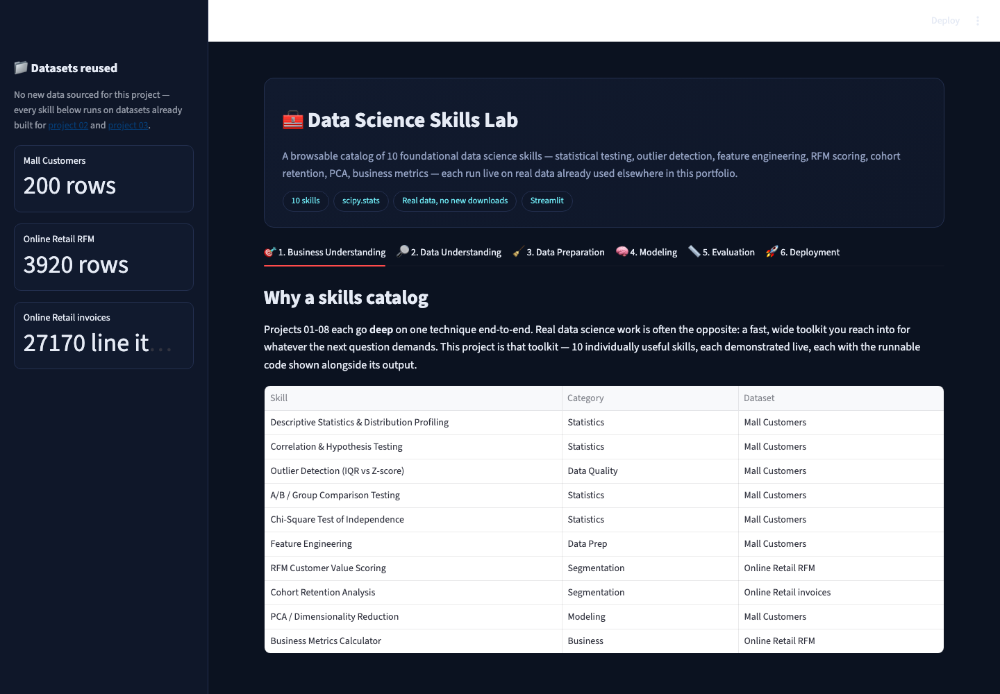
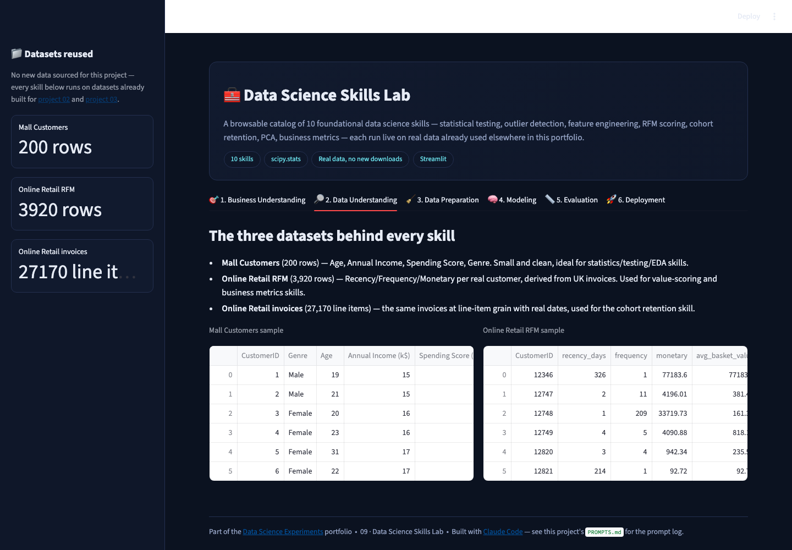
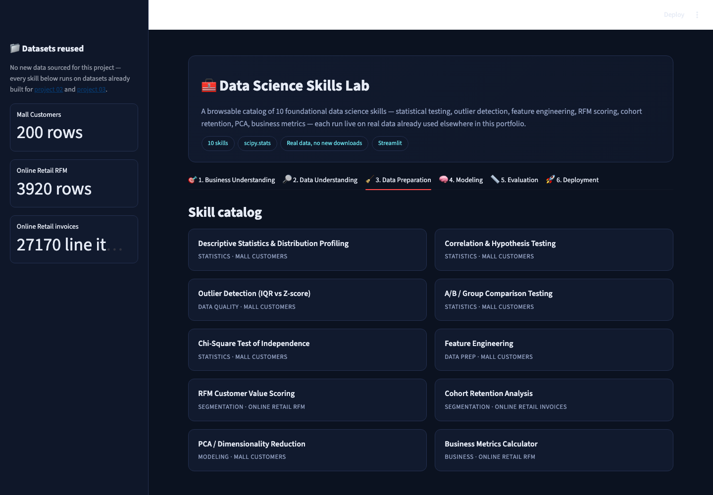
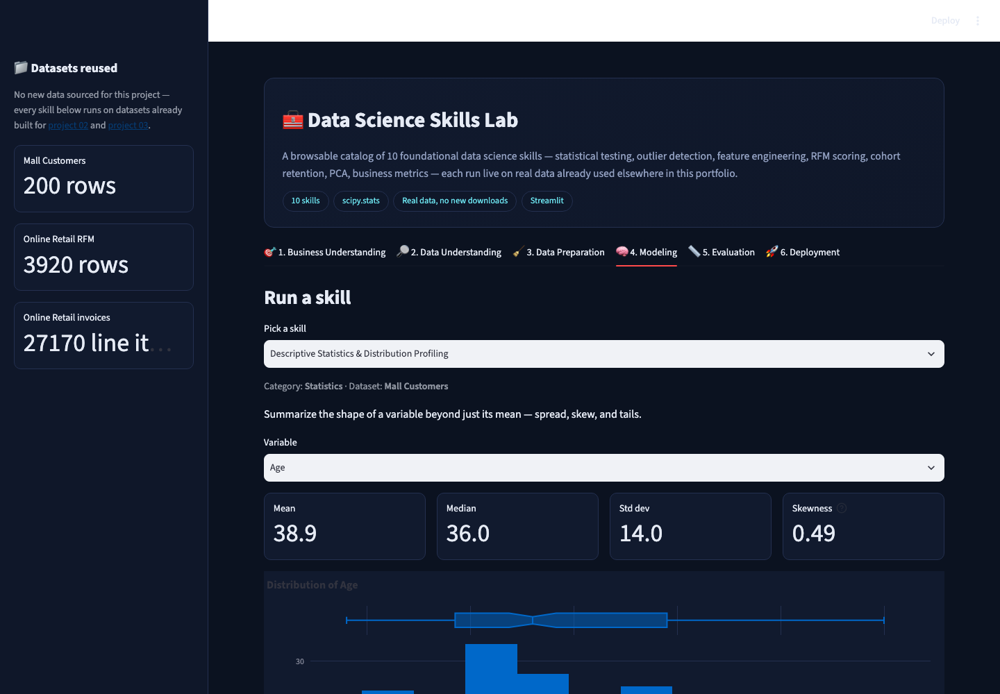
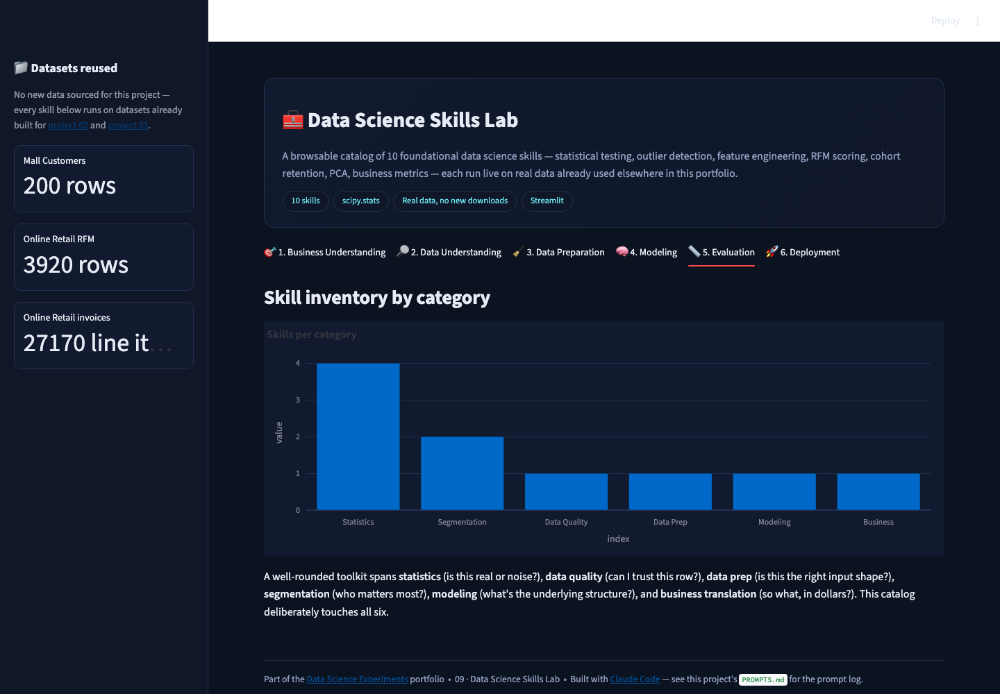
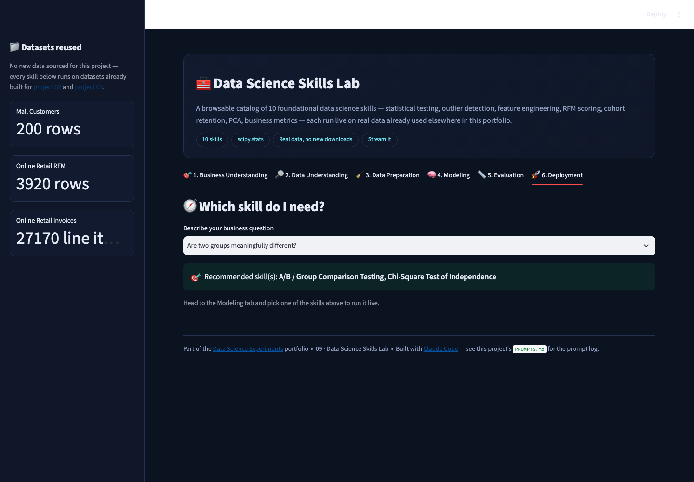

# 🧰 Data Science Skills Lab

A browsable catalog of **10 individually useful data science skills** —
statistical testing, outlier detection, feature engineering, RFM scoring,
cohort retention, PCA, business metrics — each demonstrated **live** on real
data already built for other projects in this portfolio. No new datasets,
no new downloads.

▶ **Run it:** `streamlit run app.py` (from this folder, with the repo's
`requirements.txt` installed) → open `http://localhost:8501`

[⬅ Back to portfolio root](../README.md) · [Prompt log](./PROMPTS.md)

---

## Why a skills catalog

Projects 01-08 each go **deep** on one technique end-to-end. Real data
science work is often the opposite: a fast, wide toolkit reached into for
whatever the next question demands. This project is that toolkit — 10
individually useful skills, each with the runnable code shown alongside its
output, closing with a "which skill do I need?" recommender.

## The datasets (all reused, zero new downloads)

* **Mall Customers** (200 rows, from [project 02](../02_customer_segmentation_clustering)) — statistics, testing, outlier, and feature-engineering skills.
* **Online Retail RFM** (3,920 rows, from project 02) — value-scoring and business-metrics skills.
* **Online Retail invoices** (27,170 line items, from [project 03](../03_market_basket_mining)) — the cohort-retention skill, which needs real invoice dates.

## Screenshot tour

| Business Understanding | Data Understanding |
|---|---|
|  |  |

| Data Preparation (skill catalog) | Modeling (run a skill live) |
|---|---|
|  |  |

| Evaluation (skill inventory) | Deployment (skill recommender) |
|---|---|
|  |  |

*Cohort retention in action:*

## The 10 skills

| Skill | Category | Dataset |
|---|---|---|
| Descriptive Statistics & Distribution Profiling | Statistics | Mall Customers |
| Correlation & Hypothesis Testing | Statistics | Mall Customers |
| Outlier Detection (IQR vs Z-score) | Data Quality | Mall Customers |
| A/B / Group Comparison Testing | Statistics | Mall Customers |
| Chi-Square Test of Independence | Statistics | Mall Customers |
| Feature Engineering | Data Prep | Mall Customers |
| RFM Customer Value Scoring | Segmentation | Online Retail RFM |
| Cohort Retention Analysis | Segmentation | Online Retail invoices |
| PCA / Dimensionality Reduction | Modeling | Mall Customers |
| Business Metrics Calculator | Business | Online Retail RFM |

## Walking through the six CRISP-DM tabs

1. **Business Understanding** — why a wide toolkit matters alongside deep,
   single-technique projects; the full skill catalog with categories.
2. **Data Understanding** — the three reused datasets, introduced once.
3. **Data Preparation** — a card-grid gallery of all 10 skills.
4. **Modeling** — the actual interactive part: pick a skill, run it live,
   see the output and the code that produced it.
5. **Evaluation** — a skill-inventory bar chart by category (Statistics,
   Data Quality, Data Prep, Segmentation, Modeling, Business).
6. **Deployment** — describe a business question in plain language, get a
   recommended skill (or two) to reach for.

## How it's built

* Every skill is a small, self-contained Python function
  `(mall, rfm, baskets) -> renders itself` registered in a `SKILLS` dict —
  adding an 11th skill means writing one function and one dict entry.
* `scipy.stats` for hypothesis testing (`pearsonr`, `ttest_ind`,
  `chi2_contingency`), `sklearn.decomposition.PCA` for dimensionality
  reduction — no skill reimplements statistics from scratch.
* The cohort-retention skill computes real month-over-month retention via
  `groupby` + `pivot`, not a canned example.

## Honest limitations

* 10 skills is a deliberately curated subset, not the source repo's full
  54-skill catalog — chosen for breadth across categories rather than
  exhaustive coverage.
* The skill recommender (Deployment tab) is a small hardcoded
  question→skill lookup table, not a learned recommendation model — an
  honest, simple choice for a catalog this size.
