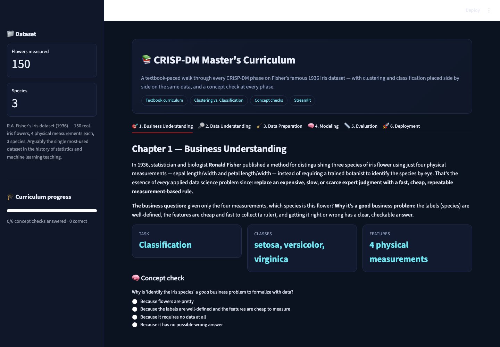
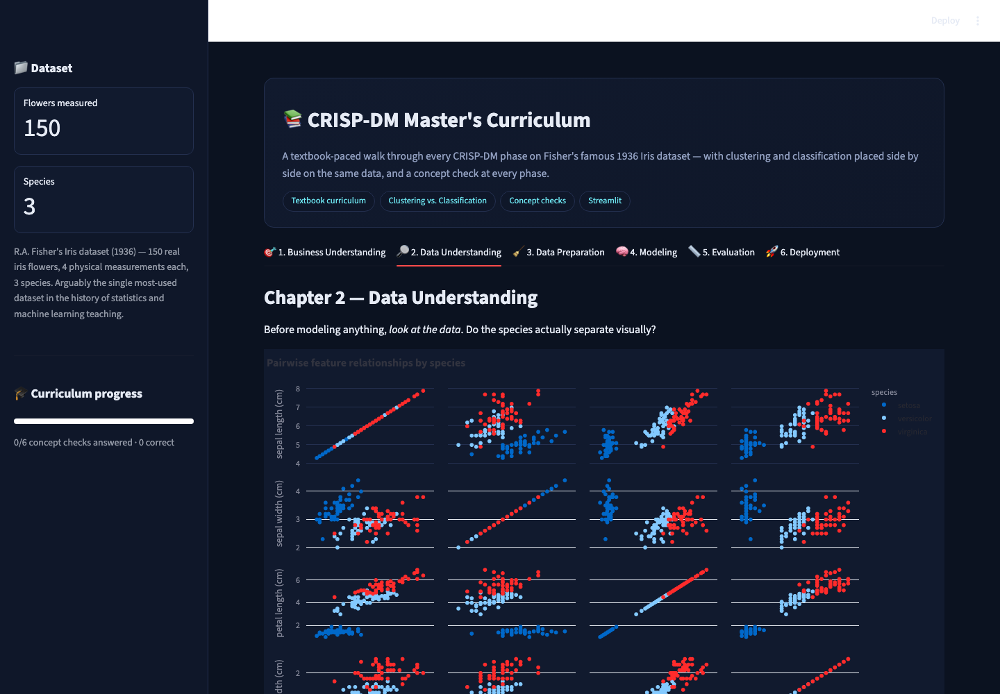
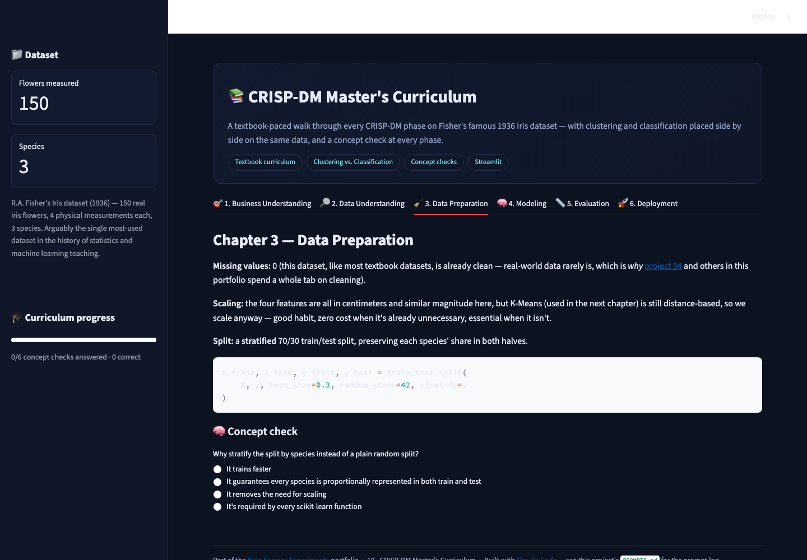
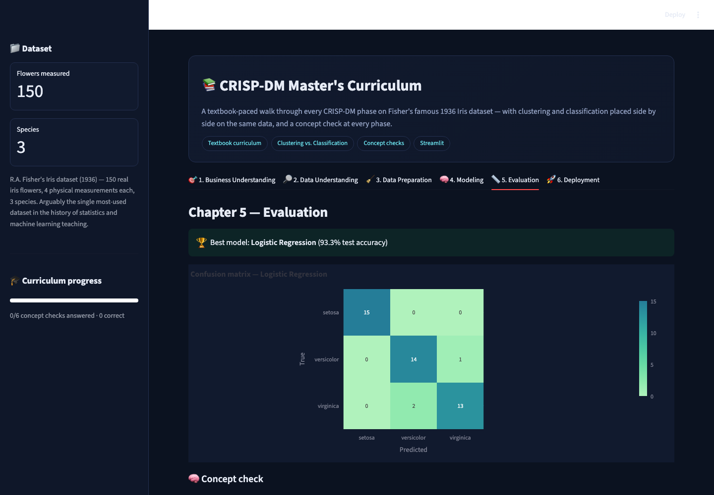
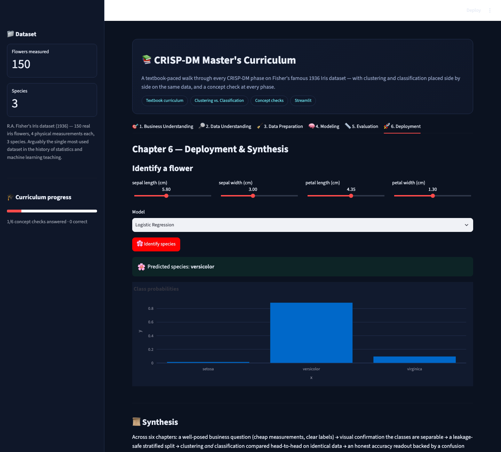

# 📚 CRISP-DM Master's Curriculum

A textbook-paced walk through **every** CRISP-DM phase on a single,
historically famous dataset — Fisher's Iris flowers (1936) — with a concept
check at each phase and clustering placed directly next to classification
on the exact same data.

▶ **Run it:** `streamlit run app.py` (from this folder, with the repo's
`requirements.txt` installed) → open `http://localhost:8501`

[⬅ Back to portfolio root](../README.md) · [Prompt log](./PROMPTS.md)

---

## What makes this project different

Projects 01-06 each go deep on **one** technique. [Project 07](../07_data_science_visual_foundations)
teaches four **isolated** math/stats concepts. This project's teaching
point is neither — it puts **unsupervised clustering and supervised
classification side by side on identical data**, so the actual difference
between "discover structure with no labels" and "predict a known label"
is directly visible in one place, rather than spread across separate
projects with different datasets that make the comparison hard to see.

## The dataset

**Fisher's Iris dataset** (1936) — 150 real iris flowers, 4 physical
measurements each (sepal/petal length & width), 3 species. Arguably the
single most-used dataset in the history of statistics and machine learning
teaching, bundled directly in scikit-learn (zero download).

## Screenshot tour

| Chapter 1 — Business Understanding | Chapter 2 — Data Understanding |
|---|---|
|  |  |

| Chapter 3 — Data Preparation | Chapter 4 — Modeling (clustering vs. classification) |
|---|---|
|  |  |

| Chapter 5 — Evaluation | Chapter 6 — Deployment & Synthesis |
|---|---|
|  |  |

## Walking through the six chapters

1. **Business Understanding** — why "replace expert judgment with cheap
   measurement" (Fisher's original 1936 framing) is the template for almost
   every applied data science problem since.
2. **Data Understanding** — a full pairwise scatter matrix; petal
   length/width visually separate the species far more cleanly than sepal
   measurements.
3. **Data Preparation** — a real leakage-safe, stratified 70/30 split, plus
   an explicit note on why scaling is applied here even though it's nearly
   unnecessary on this particular clean dataset (good habit, zero cost).
4. **Modeling** — K-Means clustering (blind to species labels) plotted next
   to the true species labels, with Adjusted Rand Index quantifying the
   agreement, followed by a 3-classifier comparison (Logistic Regression,
   Decision Tree, Random Forest) on the same held-out split.
5. **Evaluation** — a confusion matrix for the best classifier, and an
   explicit discussion of *why* accuracy is trustworthy here (balanced
   classes) when it wouldn't be on an imbalanced problem like
   [project 04](../04_fraud_anomaly_detection).
6. **Deployment & Synthesis** — a live "identify this flower" predictor,
   plus a closing synthesis tying all six chapters together and a running
   concept-check score.

## Concept checks

Every chapter ends with a short, immediately-graded multiple-choice
question (tracked in the sidebar's "Curriculum progress" bar) — the same
teaching device as [project 07](../07_data_science_visual_foundations)'s
closing quiz, but woven through the journey instead of saved for the end.

## How it's built

* `sklearn.datasets.load_iris`, `sklearn.cluster.KMeans`,
  `sklearn.metrics.adjusted_rand_score` for the clustering-vs-classification
  comparison; `LogisticRegression`, `DecisionTreeClassifier`,
  `RandomForestClassifier` for the supervised side.
* `st.session_state` threads the fitted models and train/test split from
  the Modeling tab into Evaluation and Deployment within the same run.
* The concept-check widget (`concept_check()`) is one small reusable
  function — six calls, one implementation.

## Honest limitations

* Iris is a famously *easy*, cleanly-separable dataset chosen specifically
  for its teaching pedigree — real classification problems overlap far
  more, which the Modeling tab's discussion says directly rather than
  implying every problem looks this clean.
* The concept-check quiz is intentionally short (1 question/chapter, 6
  total) — depth of assessment was traded for keeping the curriculum
  moving at a readable pace.
