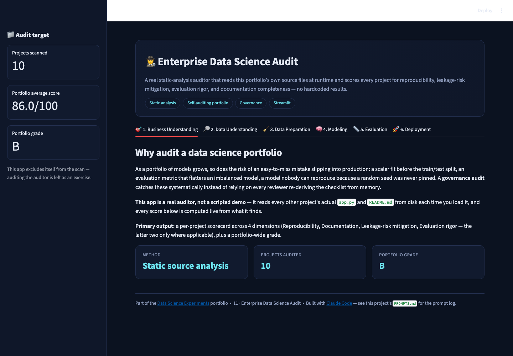
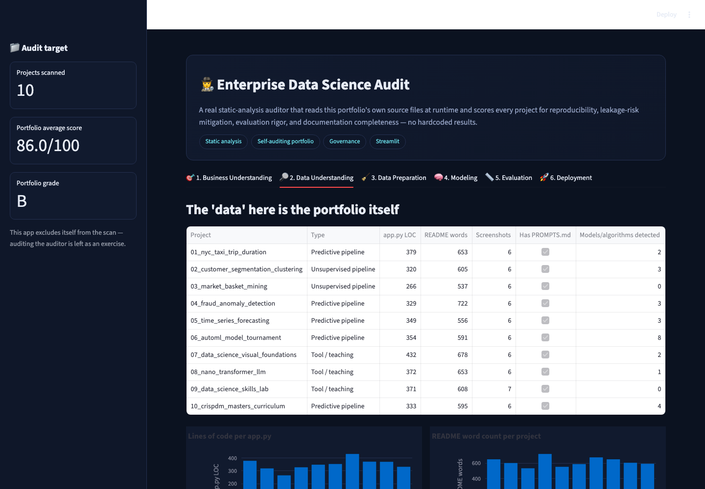
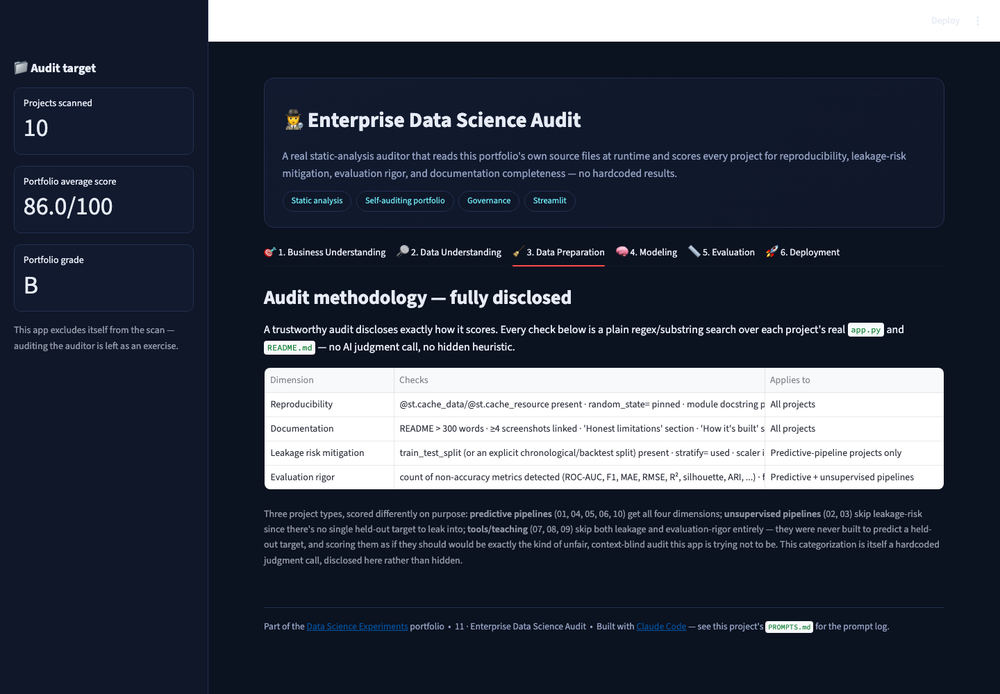
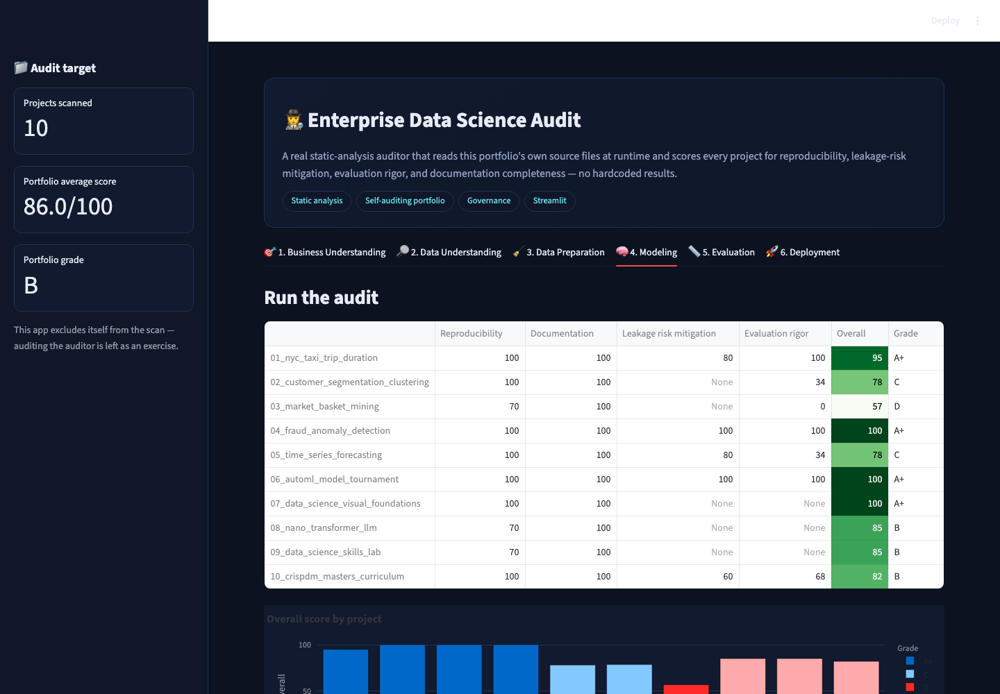
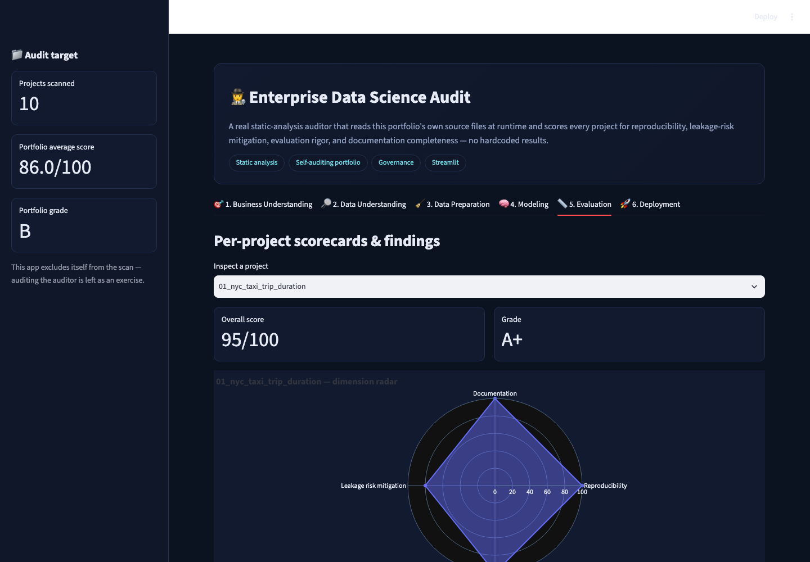
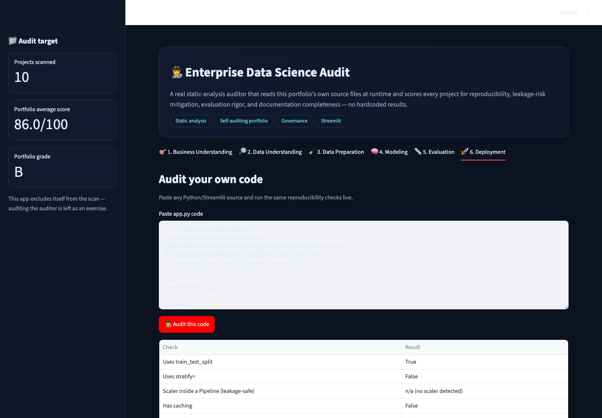

# 🕵️ Enterprise Data Science Audit

A **real static-analysis auditor** — not a mockup — that reads this
portfolio's own `app.py` and `README.md` files from disk at runtime and
scores every project against a reproducibility/leakage/documentation
rubric. Every number in this app is computed live from the current state
of the repository, and the rubric methodology itself is fully disclosed
in-app rather than hidden.

▶ **Run it:** `streamlit run app.py` (from this folder, with the repo's
`requirements.txt` installed) → open `http://localhost:8501`

[⬅ Back to portfolio root](../README.md) · [Prompt log](./PROMPTS.md)

---

## The business problem

As a portfolio of models grows, so does the risk of an easy-to-miss
mistake slipping in unnoticed: a scaler fit before the train/test split, an
evaluation metric that flatters an imbalanced model, a model nobody can
reproduce because a random seed was never pinned. A **governance audit**
catches these systematically instead of relying on every reviewer to
re-derive the checklist from memory — and a *self*-auditing portfolio (this
project audits the other 10 in this very repo) is a direct, checkable
demonstration that the discipline was actually followed, not just claimed.

**Primary output:** a per-project scorecard across up to 4 dimensions
(Reproducibility, Documentation, Leakage-risk mitigation, Evaluation
rigor), plus a portfolio-wide grade.

## Three project types, scored fairly

A flat rubric applied to every project regardless of what it actually does
produces unfair false positives. This audit categorizes projects before
scoring them:

* **Predictive pipelines** (01, 04, 05, 06, 10) — get all 4 dimensions,
  including leakage-risk (train/test split, stratification, scaler
  placement) and evaluation rigor (which metrics are used).
* **Unsupervised pipelines** (02, 03) — skip leakage-risk entirely; there's
  no single held-out target for a clustering or association-rule project to
  leak into. Still scored on evaluation rigor and documentation.
* **Tools / teaching** (07, 08, 09) — skip both leakage and evaluation-rigor
  dimensions; they were never built to predict a held-out target, and
  scoring them as if they should would be exactly the kind of unfair,
  context-blind audit this app tries not to be.

This categorization is itself a hardcoded judgment call — disclosed
directly in the Data Preparation tab rather than hidden inside the scoring
code.

## Screenshot tour

| Business Understanding | Data Understanding (the portfolio itself) |
|---|---|
|  |  |

| Data Preparation (methodology, disclosed) | Modeling (run the audit) |
|---|---|
|  |  |

| Evaluation (per-project scorecards) | Deployment (audit your own code) |
|---|---|
|  |  |

## How it's built

* Pure `re`/substring checks over real file contents read with
  `Path.read_text()` — no AST parsing, no LLM call, no hidden judgment.
  Every check is listed verbatim in the Data Preparation tab.
* `@st.cache_data` caches each project's audit by name — restart the app
  (or edit a project's files) to see updated results; the cache is keyed on
  project name, not file content, matching this app's own "no hidden
  caching gotchas" standard from its own rubric.
* The Deployment tab runs the same core checks (minus the doc/README ones,
  which need a whole project folder) against **any** pasted code — a
  generalizable tool, not just something wired to this one repo.

## What the audit actually found (and what it got wrong at first)

Building this caught two real, honest lessons about naive static analysis:

1. **A genuine bug, fixed**: an early version required every project to
   contain `sklearn.train_test_split` to score well on leakage-risk —
   unfairly penalizing [project 02](../02_customer_segmentation_clustering)
   (clustering) and [project 03](../03_market_basket_mining) (association
   rules), neither of which has a single held-out predictive target at all.
   Fixed by introducing the "Unsupervised pipeline" category above.
2. **A genuine false negative, fixed**: [project 04](../04_fraud_anomaly_detection)
   fits its scaler explicitly on `X_train` only (correct, leakage-safe) but
   not inside an sklearn `Pipeline` object — the original regex only
   recognized the `Pipeline(...)` idiom as "safe," so it flagged
   genuinely-safe code as risky. Fixed by also recognizing an explicit
   `scaler = ....fit(X_train...)` pattern.

## Honest limitations

* **Still a keyword/regex auditor, not a semantic one.** [Project 05](../05_time_series_forecasting)
  hand-rolls MAE/RMSE/MAPE with plain `numpy` instead of calling
  `sklearn.metrics.mean_absolute_error` by name — mathematically identical,
  but invisible to a check that looks for the sklearn function name. This
  auditor will always have some false negatives like this; a genuinely
  complete audit needs a human (or an LLM) reading the code with context,
  not a regex.
* **The categorization list (which projects are "predictive" vs.
  "unsupervised" vs. "tool") is manually maintained**, not auto-detected —
  adding a 12th project means updating that list by hand.
* **This app excludes itself from the scan.** Auditing the auditor's own
  `app.py` against its own rubric is left as an exercise — genuinely
  possible (the code has no hardcoded assumption it can't be its own
  target), just not wired up by default.
