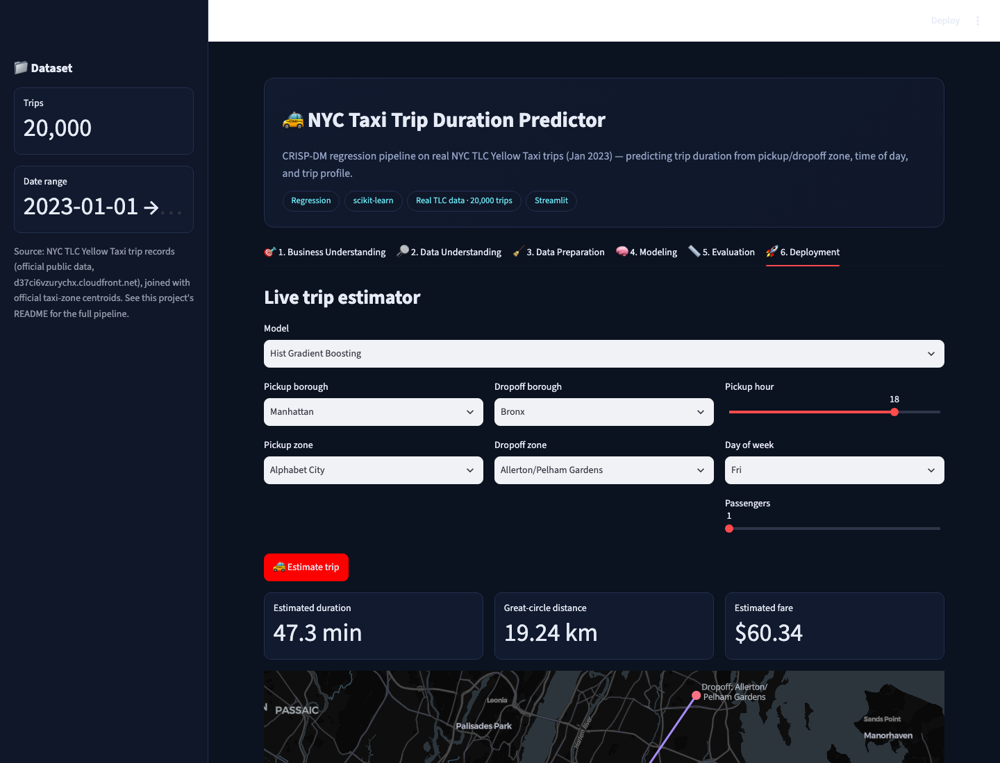
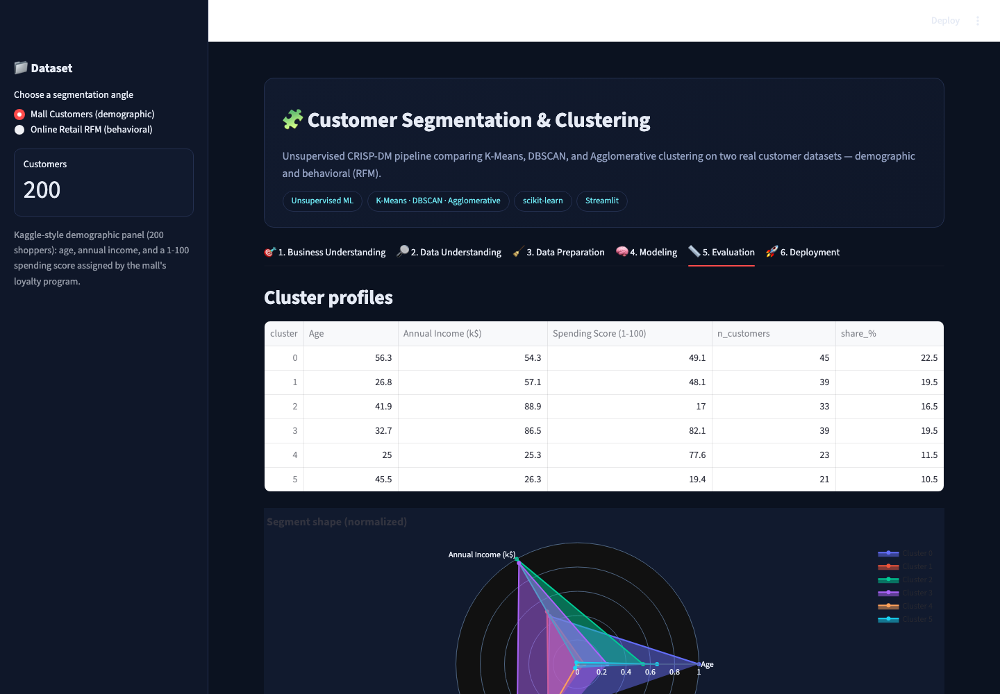
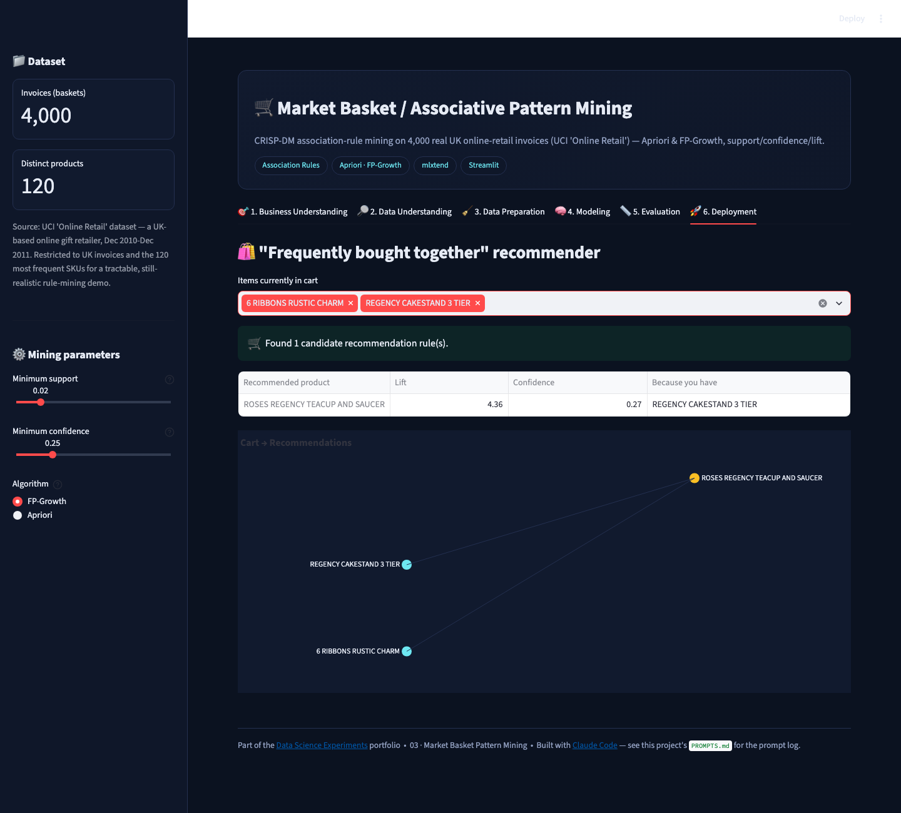
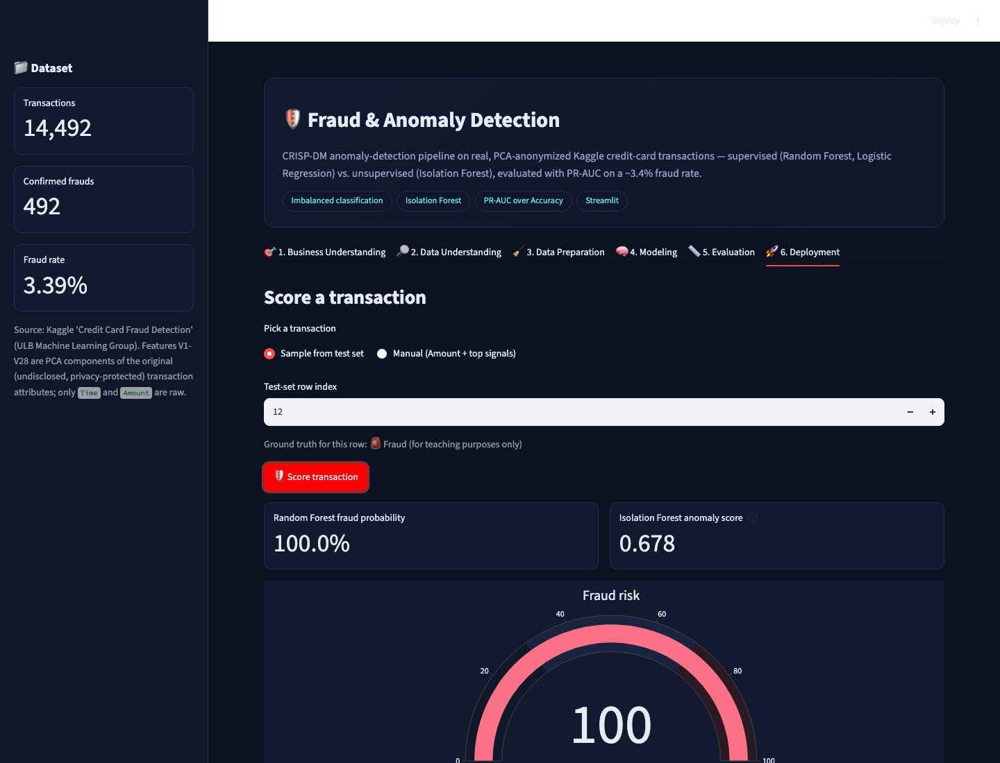

# 📊 Data Science Experiments — with Claude Code

A hands-on portfolio of **four end-to-end, CRISP-DM-structured data science
projects**, each a real interactive app (not just a notebook), built almost
entirely inside **[Claude Code](https://claude.com/claude-code)** as an
assignment replicating (and improvising on) the workflow demonstrated in
[dlmastery/data_science_examples](https://github.com/dlmastery/data_science_examples).

**🎥 Video walkthrough:** _[add your YouTube link here before submitting — see "Video walkthrough" below]_

---

## 🧭 What this is

The source repository builds 16 full-stack (FastAPI + React) data science
products. Rather than rebuild all sixteen shallowly, this repo takes **four**
of the same core techniques and builds each one **deep**: real public
datasets (no synthetic stand-ins), multiple competing models per project,
honest evaluation (the metric that actually matters for each problem, not
just accuracy), and a genuinely usable live-inference UI — packaged as a
single-file [Streamlit](https://streamlit.io) app per project instead of a
separate backend/frontend pair, so anyone can clone this repo and be
clicking around a running app in under a minute.

| # | Project | Technique | Real dataset | Try it |
|---|---|---|---|---|
| 01 | [**NYC Taxi Trip Duration Predictor**](./01_nyc_taxi_trip_duration) | Regression (Linear / Random Forest / HistGB) | NYC TLC official Yellow Taxi trips, Jan 2023 (20k trips) | `streamlit run 01_nyc_taxi_trip_duration/app.py` |
| 02 | [**Customer Segmentation & Clustering**](./02_customer_segmentation_clustering) | Unsupervised clustering (K-Means / DBSCAN / Agglomerative) | Mall Customers (demographic) **+** UCI Online Retail RFM (behavioral) | `streamlit run 02_customer_segmentation_clustering/app.py` |
| 03 | [**Market Basket / Associative Pattern Mining**](./03_market_basket_mining) | Association rules (Apriori / FP-Growth) | UCI Online Retail — 4,000 real UK invoices | `streamlit run 03_market_basket_mining/app.py` |
| 04 | [**Fraud & Anomaly Detection**](./04_fraud_anomaly_detection) | Imbalanced classification / anomaly detection | Kaggle Credit Card Fraud (ULB) — 492 real confirmed frauds | `streamlit run 04_fraud_anomaly_detection/app.py` |

Every project follows the same **six-phase CRISP-DM** structure as tabs —
Business Understanding → Data Understanding → Data Preparation → Modeling →
Evaluation → Deployment — so the methodology is consistent even though the
techniques are completely different.

---

## 🖼️ Tour

<table>
<tr>
<td width="50%">

**01 · NYC Taxi Trip Duration**
[](./01_nyc_taxi_trip_duration)
Live trip-duration & fare estimator with a real pickup→dropoff route map.

</td>
<td width="50%">

**02 · Customer Segmentation**
[](./02_customer_segmentation_clustering)
Elbow/silhouette-tuned K-Means personas, switchable between two real datasets.

</td>
</tr>
<tr>
<td width="50%">

**03 · Market Basket Mining**
[](./03_market_basket_mining)
"Frequently bought together" recommender from real Apriori/FP-Growth rules.

</td>
<td width="50%">

**04 · Fraud & Anomaly Detection**
[](./04_fraud_anomaly_detection)
Supervised vs. unsupervised fraud scoring with cost-sensitive thresholding.

</td>
</tr>
</table>

Each project's own README has a full six-screenshot tour, one per CRISP-DM phase.

---

## 🎨 Design choices — where this improvises on the source repo

* **Real data, always.** Every dataset is sourced from an official or
  well-known public source at build time (NYC TLC's own S3 bucket, UCI's
  Online Retail archive, the Kaggle/ULB credit-card fraud dataset, the
  classic Mall Customers panel) — nothing here is fabricated. See
  [`_build/`](./_build) for the exact scripts and source URLs.
* **Two datasets, one app** (project 02) — the clustering app isn't limited
  to one classic dataset. A sidebar toggle switches between demographic
  segmentation (age/income/spending) and behavioral RFM segmentation
  (recency/frequency/monetary, derived from real invoices), with dataset-
  aware preprocessing (log-transforming RFM's heavy-tailed monetary/frequency
  columns before scaling — standard practice the demographic dataset doesn't
  need).
* **The metric that matters, not the one that flatters.** The fraud project
  leads with PR-AUC and a **cost-sensitive threshold slider** (you set the
  dollar cost of a missed fraud vs. a false alarm, and the app finds the
  threshold that minimizes expected cost) rather than accuracy, which would
  be trivially ~96% while catching zero fraud.
* **Genuine model tournaments**, not one model dressed up: taxi duration
  compares 3 regressors, clustering compares 3 algorithms with a live
  elbow/silhouette sweep, market basket compares Apriori vs. FP-Growth
  timing, fraud compares 2 supervised models against an Isolation Forest
  trained the textbook-correct way (fit only on the non-fraud class).
* **One shared design system** ([`common/theme.py`](./common/theme.py))
  instead of four inconsistent UIs — every app gets the same dark theme,
  CRISP-DM tab structure, and footer, from one ~80-line module.
* **Single-file Streamlit apps instead of FastAPI+React pairs** — same
  CRISP-DM rigor and interactivity as the source repo's split-stack apps,
  a fraction of the moving parts to run locally.

---

## 🚀 Quickstart

```bash
git clone https://github.com/<your-username>/data-science-experiments.git
cd data-science-experiments
python3 -m venv .venv && source .venv/bin/activate
pip install -r requirements.txt

# run any project (each is a self-contained Streamlit app)
streamlit run 01_nyc_taxi_trip_duration/app.py
streamlit run 02_customer_segmentation_clustering/app.py
streamlit run 03_market_basket_mining/app.py
streamlit run 04_fraud_anomaly_detection/app.py
```

Each app opens at `http://localhost:8501` (Streamlit's default — run two at
once with `--server.port 8502`, etc.). No API keys, no external services, no
GPU required — every dataset ships pre-built inside the repo.

---

## 🗂️ Repository structure

```
data-science-experiments/
├── README.md                          ← you are here
├── PROMPTS.md                         ← prompt log: what was asked, in order
├── requirements.txt
├── common/theme.py                    ← shared dark UI theme for all 4 apps
├── _build/                            ← scripts that built each dataset from public sources
├── 01_nyc_taxi_trip_duration/
│   ├── app.py  ·  data/  ·  screenshots/  ·  README.md  ·  PROMPTS.md
├── 02_customer_segmentation_clustering/
│   ├── app.py  ·  data/  ·  screenshots/  ·  README.md  ·  PROMPTS.md
├── 03_market_basket_mining/
│   ├── app.py  ·  data/  ·  screenshots/  ·  README.md  ·  PROMPTS.md
└── 04_fraud_anomaly_detection/
    ├── app.py  ·  data/  ·  screenshots/  ·  README.md  ·  PROMPTS.md
```

---

## 🧪 The CRISP-DM structure, applied

**CRISP-DM** (Cross-Industry Standard Process for Data Mining) is the
decades-old, still-dominant methodology for structuring a data science
project: Business Understanding → Data Understanding → Data Preparation →
Modeling → Evaluation → Deployment. Every app in this repo makes those six
phases literal, navigable tabs, so you can see not just a model's output but
*why* it was built that way — the business question it answers, what the raw
data actually looks like, what cleaning/leakage-prevention steps were taken,
which models were compared and why, which metric was chosen to judge them
(and why accuracy alone would have been misleading), and finally a live
"deployment" surface you can interact with.

---

## 🤖 Built with Claude Code

Every line of code, every dataset-build script, and every README in this
repository was produced in collaboration with **Claude Code** (Anthropic's
CLI coding agent), acting as the "favorite coding assistant" this assignment
calls for. See [`PROMPTS.md`](./PROMPTS.md) for the running log of what was
asked, and each project's own `PROMPTS.md` for project-specific asks.

## 🎥 Video walkthrough

_Add the YouTube link here._ The video should walk through, for each of the
four projects: the business problem, a tour of the six CRISP-DM tabs, and a
live demo of the Deployment tab (estimating a taxi trip, assigning a
customer segment, getting a market-basket recommendation, and scoring a
fraud transaction).

## 📄 License & data attribution

Code in this repository is MIT-licensed (see [`LICENSE`](./LICENSE)).
Datasets are redistributed in cleaned/sampled form under their original
public terms — see [`_build/README.md`](./_build/README.md) for the exact
source and license of each one (NYC TLC public data, UCI Machine Learning
Repository, and the Kaggle/ULB Credit Card Fraud dataset).
