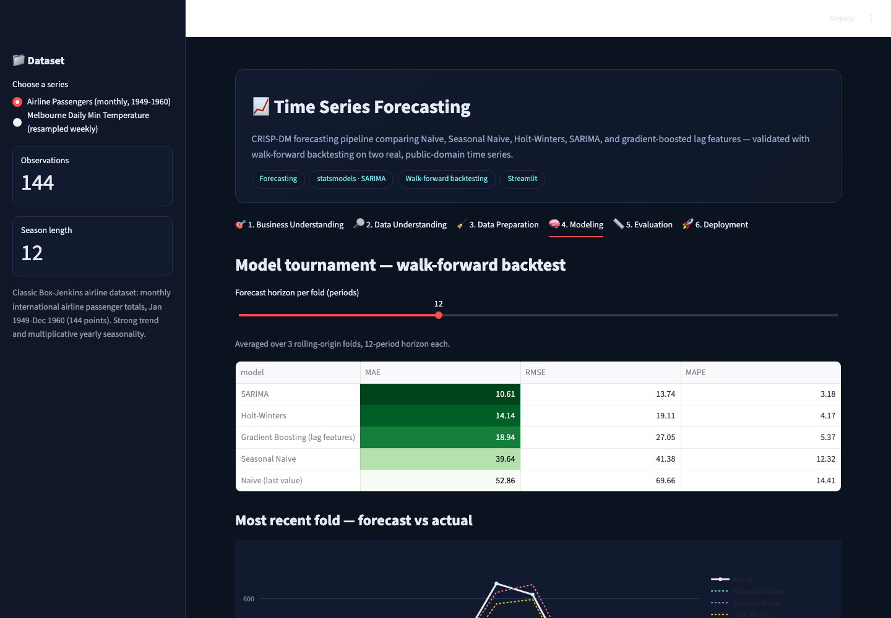
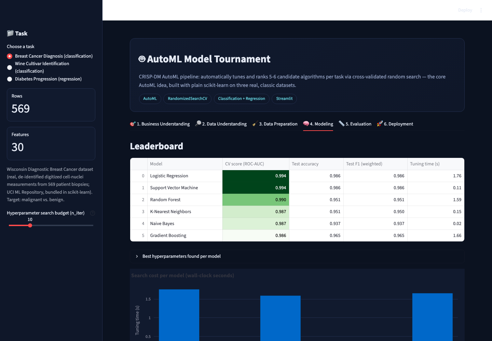
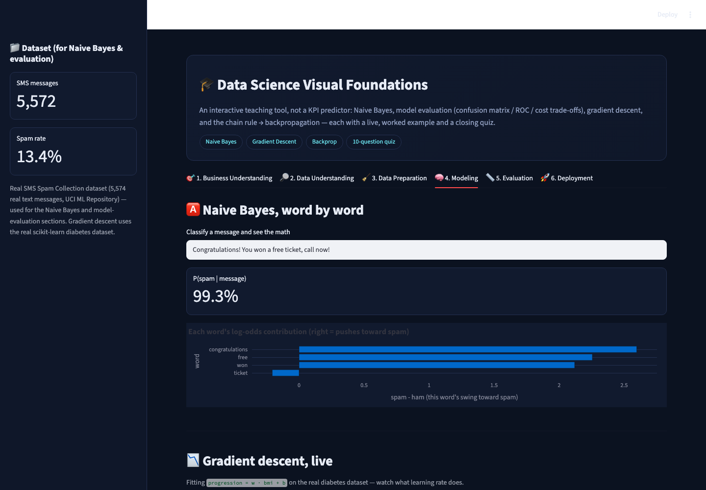
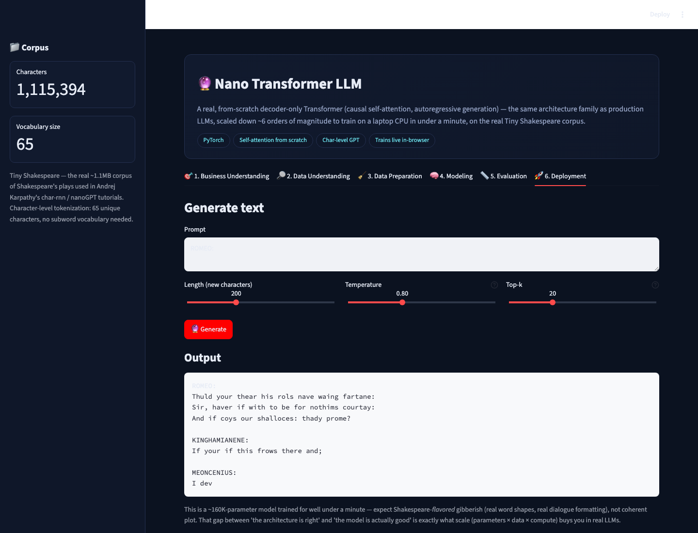
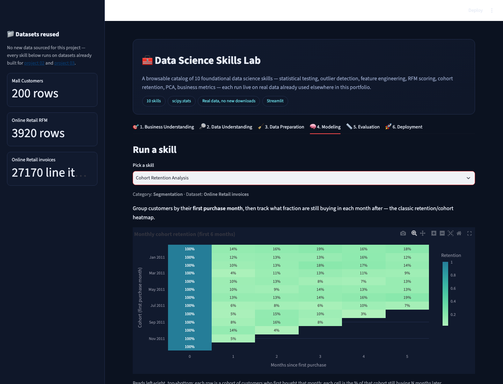
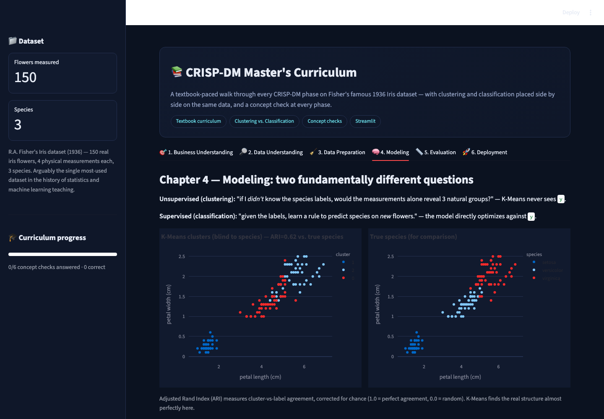

# 📊 Data Science Experiments — with Claude Code

A hands-on portfolio of **eleven end-to-end, CRISP-DM-structured data
science projects**, each a real interactive app (not just a notebook),
built almost entirely inside **[Claude Code](https://claude.com/claude-code)**
as an assignment replicating (and improvising on) the workflow demonstrated
in [dlmastery/data_science_examples](https://github.com/dlmastery/data_science_examples).

**🎥 Video walkthrough:** _[[Demo](https://www.youtube.com/watch?v=l2bjdQBmL8A&t=3s)]_

---

## 🧭 What this is

The source repository builds 16 full-stack (FastAPI + React) data science
products. Rather than rebuild all sixteen shallowly, this repo takes
**eleven** of the same core ideas — spanning classical ML, forecasting,
AutoML, teaching tools, a from-scratch deep learning model, a wide skills
catalog, a full guided curriculum, and a self-auditing governance tool —
and builds each one **deep**: real public datasets (no synthetic
stand-ins), multiple competing models per project, honest evaluation (the
metric that actually matters for each problem, not just accuracy), and a
genuinely usable live-inference UI — packaged as a single-file
[Streamlit](https://streamlit.io) app per project instead of a separate
backend/frontend pair, so anyone can clone this repo and be clicking around
a running app in under a minute.

| # | Project | Technique | Real dataset | Try it |
|---|---|---|---|---|
| 01 | [**NYC Taxi Trip Duration Predictor**](./01_nyc_taxi_trip_duration) | Regression (Linear / Random Forest / HistGB) | NYC TLC official Yellow Taxi trips, Jan 2023 (20k trips) | `streamlit run 01_nyc_taxi_trip_duration/app.py` |
| 02 | [**Customer Segmentation & Clustering**](./02_customer_segmentation_clustering) | Unsupervised clustering (K-Means / DBSCAN / Agglomerative) | Mall Customers (demographic) **+** UCI Online Retail RFM (behavioral) | `streamlit run 02_customer_segmentation_clustering/app.py` |
| 03 | [**Market Basket / Associative Pattern Mining**](./03_market_basket_mining) | Association rules (Apriori / FP-Growth) | UCI Online Retail — 4,000 real UK invoices | `streamlit run 03_market_basket_mining/app.py` |
| 04 | [**Fraud & Anomaly Detection**](./04_fraud_anomaly_detection) | Imbalanced classification / anomaly detection | Kaggle Credit Card Fraud (ULB) — 492 real confirmed frauds | `streamlit run 04_fraud_anomaly_detection/app.py` |
| 05 | [**Time Series Forecasting**](./05_time_series_forecasting) | Forecasting (Naive / Holt-Winters / SARIMA / ML) | Classic Airline Passengers **+** real Melbourne daily temperatures | `streamlit run 05_time_series_forecasting/app.py` |
| 06 | [**AutoML Model Tournament**](./06_automl_model_tournament) | Automated multi-model + hyperparameter search | 3 real scikit-learn datasets (Breast Cancer, Wine, Diabetes) | `streamlit run 06_automl_model_tournament/app.py` |
| 07 | [**Data Science Visual Foundations**](./07_data_science_visual_foundations) | Naive Bayes, model evaluation, gradient descent, backprop | Real SMS Spam Collection **+** real diabetes dataset | `streamlit run 07_data_science_visual_foundations/app.py` |
| 08 | [**Nano Transformer LLM**](./08_nano_transformer_llm) | From-scratch decoder-only Transformer (PyTorch) | Tiny Shakespeare (real ~1.1MB corpus) | `streamlit run 08_nano_transformer_llm/app.py` |
| 09 | [**Data Science Skills Lab**](./09_data_science_skills_lab) | 10-skill catalog: stats testing, RFM, cohort, PCA, ... | Reuses real data from projects 02 & 03 — no new downloads | `streamlit run 09_data_science_skills_lab/app.py` |
| 10 | [**CRISP-DM Master's Curriculum**](./10_crispdm_masters_curriculum) | Guided textbook journey: clustering *and* classification | Fisher's Iris (1936) — the original ML teaching dataset | `streamlit run 10_crispdm_masters_curriculum/app.py` |
| 11 | [**Enterprise Data Science Audit**](./11_enterprise_ds_audit) | Real static-analysis governance auditor | This portfolio's own source code (self-auditing) | `streamlit run 11_enterprise_ds_audit/app.py` |

Every project follows the same **six-phase CRISP-DM** structure as tabs —
Business Understanding → Data Understanding → Data Preparation → Modeling →
Evaluation → Deployment — so the methodology is consistent even though the
techniques (and, for 07/09/10/11, the entire purpose — teaching tools and a
governance auditor, not KPI predictors) are completely different.

---

## 🖼️ Tour

<table>
<tr>
<td width="50%">

**01 · NYC Taxi Trip Duration**
[](./01_nyc_taxi_trip_duration)
Live trip-duration & fare estimator with a real pickup→dropoff route map.

</td>
<td width="50%">

**02 · Customer Segmentation**
[](./02_customer_segmentation_clustering)
Elbow/silhouette-tuned K-Means personas, switchable between two real datasets.

</td>
</tr>
<tr>
<td width="50%">

**03 · Market Basket Mining**
[](./03_market_basket_mining)
"Frequently bought together" recommender from real Apriori/FP-Growth rules.

</td>
<td width="50%">

**04 · Fraud & Anomaly Detection**
[](./04_fraud_anomaly_detection)
Supervised vs. unsupervised fraud scoring with cost-sensitive thresholding.

</td>
</tr>
<tr>
<td width="50%">

**05 · Time Series Forecasting**
[](./05_time_series_forecasting)
5-model walk-forward forecasting tournament with a live forecast fan.

</td>
<td width="50%">

**06 · AutoML Model Tournament**
[](./06_automl_model_tournament)
Automated cross-validated leaderboard across 5-6 algorithms per task.

</td>
</tr>
<tr>
<td width="50%">

**07 · Data Science Visual Foundations**
[](./07_data_science_visual_foundations)
Naive Bayes word-by-word, live gradient descent, backprop chain rule, quiz.

</td>
<td width="50%">

**08 · Nano Transformer LLM**
[](./08_nano_transformer_llm)
A real self-attention Transformer, trained live on Shakespeare, on CPU.

</td>
</tr>
<tr>
<td width="50%">

**09 · Data Science Skills Lab**
[](./09_data_science_skills_lab)
A 10-skill catalog — real cohort retention, RFM scoring, PCA, and more.

</td>
<td width="50%">

**10 · CRISP-DM Master's Curriculum**
[](./10_crispdm_masters_curriculum)
Clustering and classification, side by side, on Fisher's 1936 Iris data.

</td>
</tr>
<tr>
<td width="50%">

**11 · Enterprise Data Science Audit**
[](./11_enterprise_ds_audit)
A real auditor that scores every other project's actual source code, live.

</td>
<td width="50%">

</td>
</tr>
</table>

Each project's own README has a full six-screenshot tour, one per CRISP-DM phase.

---

## 🎨 Design choices — where this improvises on the source repo

* **Real data, always.** Every dataset is sourced from an official or
  well-known public source at build time (NYC TLC's own S3 bucket, UCI's
  Online Retail and SMS Spam archives, the Kaggle/ULB credit-card fraud
  dataset, classic Box-Jenkins/Karpathy corpora, scikit-learn's bundled
  real-world datasets) — nothing here is fabricated. See
  [`_build/`](./_build) for the exact scripts and source URLs.
* **Two datasets, one app** (project 02) — the clustering app isn't limited
  to one classic dataset. A sidebar toggle switches between demographic
  segmentation and behavioral RFM segmentation, with dataset-aware
  preprocessing (log-transforming RFM's heavy-tailed columns before
  scaling — standard practice the demographic dataset doesn't need).
* **The metric that matters, not the one that flatters.** The fraud project
  leads with PR-AUC and a **cost-sensitive threshold slider** rather than
  accuracy, which would be trivially ~96% while catching zero fraud; the
  forecasting project evaluates with **walk-forward backtesting**, never a
  random split, which would leak future values into training.
* **Genuine model tournaments**, not one model dressed up: taxi duration
  compares 3 regressors, clustering compares 3 algorithms, market basket
  compares Apriori vs. FP-Growth, fraud compares 2 supervised models
  against an Isolation Forest trained the textbook-correct way, forecasting
  compares 5 approaches across 3 backtest folds, and AutoML automatically
  tunes 5-6 algorithms per task via cross-validated random search.
* **An honest, stated scope decision** (project 06): rather than install
  the heavyweight AutoGluon package the source repo used, the AutoML
  project is a genuine from-scratch `RandomizedSearchCV` tournament on
  plain scikit-learn — documented as a deliberate trade-off in that
  project's own README, not hidden.
* **A real deep learning model, not a mockup** (project 08): a from-scratch
  PyTorch decoder-only Transformer — real multi-head self-attention, real
  backpropagation, real sampling — trains live from random initialization
  on CPU in under a minute, with an attention-weight heatmap for genuine
  mechanistic interpretability.
* **Teaching tools alongside the business apps** (07, 09, 10): Naive Bayes
  explained word-by-word, an interactive gradient-descent visualizer, a
  worked backprop chain-rule example, a 10-skill live catalog, and
  clustering placed directly next to classification on identical data —
  the same CRISP-DM tab shell reinterpreted pedagogically instead of
  skipped.
* **A real self-auditing governance tool, not a scripted report**
  (project 11): reads every other project's actual source files from disk
  at runtime and scores them on a disclosed rubric — see that project's own
  README for two real categorization bugs the audit itself caught and had
  fixed before shipping.
* **One shared design system** ([`common/theme.py`](./common/theme.py))
  instead of eleven inconsistent UIs — every app gets the same dark theme,
  CRISP-DM tab structure, and footer, from one ~80-line module.
* **Single-file Streamlit apps instead of FastAPI+React pairs** — same
  CRISP-DM rigor and interactivity as the source repo's split-stack apps,
  a fraction of the moving parts to run locally.

---

## 🚀 Quickstart

```bash
git clone https://github.com/Akshata4/data-science-experiments.git
cd data-science-experiments
python3 -m venv .venv && source .venv/bin/activate
pip install -r requirements.txt

# run any project (each is a self-contained Streamlit app)
streamlit run 01_nyc_taxi_trip_duration/app.py
streamlit run 02_customer_segmentation_clustering/app.py
streamlit run 03_market_basket_mining/app.py
streamlit run 04_fraud_anomaly_detection/app.py
streamlit run 05_time_series_forecasting/app.py
streamlit run 06_automl_model_tournament/app.py
streamlit run 07_data_science_visual_foundations/app.py
streamlit run 09_data_science_skills_lab/app.py
streamlit run 10_crispdm_masters_curriculum/app.py
streamlit run 11_enterprise_ds_audit/app.py

# project 08 needs one extra, isolated dependency (small CPU-only wheel):
pip install torch==2.14.0 --index-url https://download.pytorch.org/whl/cpu
streamlit run 08_nano_transformer_llm/app.py
```

Each app opens at `http://localhost:8501` (Streamlit's default — run several
at once with `--server.port 8502`, etc.). No API keys, no external services,
no GPU required — every dataset ships pre-built inside the repo.

---

## 🗂️ Repository structure

```
data-science-experiments/
├── README.md                          ← you are here
├── PROMPTS.md                         ← prompt log: what was asked, in order
├── requirements.txt
├── common/theme.py                    ← shared dark UI theme for all 11 apps
├── _build/                            ← scripts that built each dataset from public sources
├── 01_nyc_taxi_trip_duration/
├── 02_customer_segmentation_clustering/
├── 03_market_basket_mining/
├── 04_fraud_anomaly_detection/
├── 05_time_series_forecasting/
├── 06_automl_model_tournament/
├── 07_data_science_visual_foundations/
├── 08_nano_transformer_llm/
├── 09_data_science_skills_lab/
├── 10_crispdm_masters_curriculum/
└── 11_enterprise_ds_audit/
    └── (each: app.py · data/ · screenshots/ · README.md · PROMPTS.md)
```

---

## 🧪 The CRISP-DM structure, applied

**CRISP-DM** (Cross-Industry Standard Process for Data Mining) is the
decades-old, still-dominant methodology for structuring a data science
project: Business Understanding → Data Understanding → Data Preparation →
Modeling → Evaluation → Deployment. Every app in this repo makes those six
phases literal, navigable tabs, so you can see not just a model's output but
*why* it was built that way — the business question it answers, what the raw
data actually looks like, what cleaning/leakage-prevention steps were taken,
which models were compared and why, which metric was chosen to judge them
(and why accuracy alone would have been misleading), and finally a live
"deployment" surface you can interact with.

## 🕵️ The portfolio audits itself

[Project 11](./11_enterprise_ds_audit) isn't decorative — it's a real
static-analysis tool that reads projects 01-10's actual source files and
scores them for reproducibility, leakage-risk mitigation, evaluation rigor,
and documentation completeness. Point it at this repo and it currently
reports a portfolio-wide grade around **B (mid-80s/100)**, with every
finding traceable to a specific, disclosed regex check against real code —
including two genuine bugs in the *auditor itself* that were caught and
fixed during development (see that project's README).

---

## 🤖 Built with Claude Code

Every line of code, every dataset-build script, and every README in this
repository was produced in collaboration with **Claude Code** (Anthropic's
CLI coding agent), acting as the "favorite coding assistant" this assignment
calls for. See [`PROMPTS.md`](./PROMPTS.md) for the running log of what was
asked, and each project's own `PROMPTS.md` for project-specific asks.

## 🎥 Video walkthrough

_Add the YouTube link here._ The video should walk through, for each of the
eleven projects: the business problem, a tour of the six CRISP-DM tabs, and
a live demo of the Deployment tab (estimating a taxi trip, assigning a
customer segment, getting a market-basket recommendation, scoring a fraud
transaction, generating a live forecast, scoring an AutoML prediction,
taking the foundations quiz, generating Shakespeare-flavored text from the
nano Transformer, running a skill from the skills lab, identifying an iris
flower, and auditing a piece of pasted code).

## 📄 License & data attribution

Code in this repository is MIT-licensed (see [`LICENSE`](./LICENSE)).
Datasets are redistributed in cleaned/sampled form under their original
public terms — see [`_build/README.md`](./_build/README.md) for the exact
source and license of each one (NYC TLC public data, UCI Machine Learning
Repository, the Kaggle/ULB Credit Card Fraud dataset, classic Box-Jenkins/
Karpathy public-domain corpora, and scikit-learn's bundled real-world
datasets).
